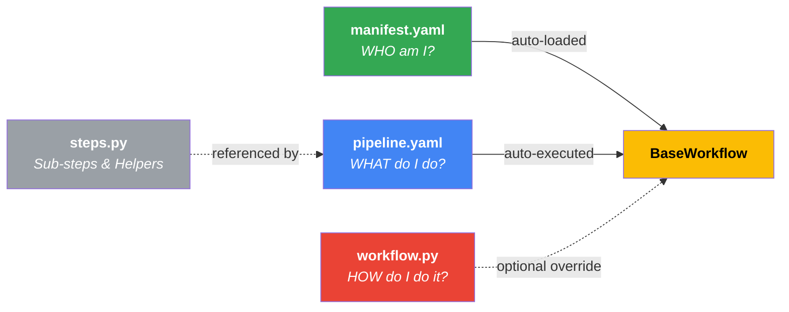

# Autopilot Architecture Standards — "The Edge"

> [!IMPORTANT]
> This document is the **SINGLE SOURCE OF TRUTH** for all architectural decisions in this codebase.
> **ALL** code generation and refactoring MUST align with these standards.

## 1. Core Philosophy: "Edge" & "Agentic"

We build **World-Class, Edge-First, Agentic Systems**.

- **Headless API Topology**: The system is a pure backend API (JSON/Events). There is **NO** internal frontend or dashboard. All interactions occur via strictly secured API endpoints (`X-API-Key`) or trusted Webhooks (Pub/Sub).
  - **CORS disabled by default**: Since all clients are server-to-server (Pub/Sub, Cloud Scheduler, API keys), `CORSMiddleware` is **not mounted** unless `API_CORS_ORIGINS` is explicitly set. This prevents any browser origin from making cross-site requests to the API. Opt-in via `API_CORS_ORIGINS=https://admin.example.com`.
- **Edge-First**: Logic should run as close to the data/user as possible. We use lightweight, efficient patterns without monolithic state.
- **Agentic**: The system is composed of autonomous, intelligent agents that interact via standard protocols.
- **Google ADK Alignment**: We strictly follow the Google Agent Development Kit (ADK) patterns.
  - **ADK Import Policy**: We only re-export types that ADK declares in its public `__all__` (e.g., `BaseMemoryService`, `InMemoryMemoryService`, `BaseArtifactService`). Internal ADK types not in `__all__` (e.g., `SearchMemoryResponse`, `MemoryEntry`, `ArtifactVersion`) are **never** re-exported from `autopilot.core` modules. For type hints, use `TYPE_CHECKING` guards — with `from __future__ import annotations`, all annotations are lazy strings, so no runtime import is needed. Tests may import internal ADK types directly from their canonical module paths.

## 2. Agent Creation Standards

### The "Factory" Pattern

⛔️ **NEVER** instantiate `LlmAgent` or `Agent` classes directly in workflow code.
✅ **ALWAYS** use the platform factory function: `create_platform_agent`.

**Why?**

- Enforces standardized observability (logging, tracing).
- Ensures consistent error handling.
- Applies uniform default configurations (models, safety settings).

**Example:**

```python
from autopilot.agents.base import create_platform_agent

# CORRECT — Standard agent
agent = create_platform_agent(
    name="my_agent",
    instruction="Do the thing",
    model="gemini-3-flash-preview",
    fallback_model="gemini-2.0-pro-exp",  # Platform handles resilience automatically
    tools=[my_tool]
)

# CORRECT — Structured output agent (Gemini native JSON mode)
agent = create_platform_agent(
    name="email_parser",
    instruction="Parse the bank email into structured data.",
    output_schema=ParsedEmail,  # Activates response_schema + response_mime_type
    output_key="parsed_email",  # ADK stores validated output in session state
)
# → ADK sets response_schema=ParsedEmail, response_mime_type=application/json
# → Agent transfers are auto-disabled (full isolation)

# WRONG
agent = LlmAgent(name="my_agent", ...)  # ❌ PROHIBITED
```

### Agent Cards

Every agent MUST have a corresponding definition in an `.agent.yaml` file (Agent Card).

- **Location**: Co-located with the agent code (e.g., `workflows/my_workflow/agents/my_agent.agent.yaml`).
- **Purpose**: Defines metadata, input/output schemas, and testing configurations declaratively.

### Agent Guardrails (`autopilot.agents.guardrails`)

⛔️ **NEVER** implement guardrail callbacks directly in workflow code.
✅ **ALWAYS** use the platform guard factories and compose them via `create_chained_before_callback` / `create_chained_after_callback`.

**Why?**

- Eliminates code duplication (e.g., `_extract_response_text` helpers).
- Guards are configurable via parameters — only the threshold values are domain-specific.
- Consistent logging and response formatting across all agents.

| Guard Factory            | Type     | Purpose                                           | Key Parameters                  |
| ------------------------ | -------- | ------------------------------------------------- | ------------------------------- |
| `input_length_guard`     | `before` | Reject inputs shorter than `min_chars`            | `min_chars`, `message`          |
| `prompt_injection_guard` | `before` | Detect prompt injection via regex patterns        | `patterns`, `message`           |
| `uuid_format_guard`      | `after`  | Validate UUID format in JSON output fields        | `fields` (tuple of field names) |
| `amount_sanity_guard`    | `after`  | Block outputs with amounts exceeding `max_amount` | `max_amount` (required)         |

**Example:**

```python
from autopilot.agents.guardrails import (
    input_length_guard,
    prompt_injection_guard,
    uuid_format_guard,
    amount_sanity_guard,
)
from autopilot.agents.callbacks import (
    create_chained_before_callback,
    create_chained_after_callback,
)

agent = create_platform_agent(
    name="email_parser",
    instruction="...",
    before_model_callback=create_chained_before_callback(
        input_length_guard(min_chars=10),
        prompt_injection_guard(),
    ),
    after_model_callback=create_chained_after_callback(
        amount_sanity_guard(max_amount=50_000_000),  # COP threshold
        uuid_format_guard(),
    ),
)
```

**Workflow-Specific Guards:**

Guards that depend on **domain-specific fields** (e.g., `payee`, `category_name`) belong in the workflow's own `agents/guardrails.py`, not at the platform level. These guards follow the same factory pattern but are scoped to a single workflow.

```python
# workflows/bank_to_ynab/agents/guardrails.py
from workflows.bank_to_ynab.agents.guardrails import semantic_coherence_guard

agent = create_platform_agent(
    name="categorizer",
    after_model_callback=create_chained_after_callback(
        semantic_coherence_guard(rules=rules),  # Domain: payee↔category
        uuid_format_guard(fields=("category_id",)),  # Platform: UUID format
    ),
)
```

> [!CAUTION]
> **Platform guards** = generic, reusable across any workflow (input validation, injection, UUID format, amount limits).
> **Workflow guards** = domain-specific, depend on workflow model fields. Keep them in `<workflow>/agents/guardrails.py`.
> Never duplicate platform guard logic in a workflow.

### Model Rate Limiter (`autopilot.agents.rate_limiter`)

LLM model calls are rate-limited via a **dual-layer strategy**, fully aligned with Google ADK:

| Layer       | Type                  | Mechanism                                     | Purpose                                                        |
| ----------- | --------------------- | --------------------------------------------- | -------------------------------------------------------------- |
| **Layer 1** | Reactive (ADK‑native) | `HttpRetryOptions` in `GenerateContentConfig` | Auto-retries transient 429s from the Gemini API                |
| **Layer 2** | Proactive (platform)  | `before_model_callback` + token-bucket        | Prevents 429s by throttling QPM locally before hitting the API |

**Layer 1** is always-on and injected automatically by `create_platform_agent`. **Layer 2** is opt-in via the `MODEL_RATE_LIMIT_QPM` environment variable.

**Configuration (12-Factor):**

| Variable               | Default        | Purpose                                                    |
| ---------------------- | -------------- | ---------------------------------------------------------- |
| `MODEL_RATE_LIMIT_QPM` | `0` (disabled) | Queries-per-minute per model. `0` = no proactive limiting. |

**Architecture:**

- Each model ID gets an independent token bucket (`_TokenBucket`).
- Uses **back-pressure** (`asyncio.sleep`) — calls wait for their turn instead of failing.
- `asyncio.Lock` per bucket — safe for single-worker asyncio (Cloud Run optimal).
- Fires **first** in the `before_model_callback` chain (before guardrails and logging).

```python
# Production deploy: enable proactive rate limiting
gcloud run deploy autopilot --set-env-vars MODEL_RATE_LIMIT_QPM=1500
```

### Context Caching (`autopilot.agents.context_cache`)

Gemini supports **context caching** — pre-caching system instructions and tool schemas server-side. Subsequent requests skip re-processing, reducing both latency and token costs (up to 75% savings).

Context caching is a **per-agent opt-in** feature via `create_platform_agent(cache_context=True)`. Only agents with long, static instructions benefit from caching (e.g., categorizer with 50+ category rules). Short/dynamic agents should NOT cache.

```python
# ✅ CORRECT — Agent with long static instructions opts in
agent = create_platform_agent(
    name="categorizer",
    instruction=LONG_CATEGORIZER_INSTRUCTION,  # 50+ categories
    cache_context=True,  # Enables Gemini context caching
    output_schema=CategorizedTransaction,
    tools=["ynab.get_categories_string"],
)

# ✅ CORRECT — Agent with short/dynamic instructions does NOT cache (default)
agent = create_platform_agent(
    name="email_parser",
    instruction="Parse the email...",
    # cache_context defaults to False — no caching overhead
)
```

**How it works:**

1. `create_platform_agent(cache_context=True)` sets a marker attribute on the `LlmAgent`
2. `ADKRunner` checks the marker → if set, wraps the agent in `App(context_cache_config=...)` → ADK caches automatically
3. If not set → uses standard `Runner(app_name=, agent=)` → zero caching overhead

**Configuration (12-Factor):**

| Variable                    | Default | Purpose                       |
| --------------------------- | ------- | ----------------------------- |
| `CONTEXT_CACHE_MIN_TOKENS`  | `2048`  | Min tokens to trigger caching |
| `CONTEXT_CACHE_TTL_SECONDS` | `1800`  | Cache TTL (30 min)            |
| `CONTEXT_CACHE_INTERVALS`   | `10`    | Max uses before refresh       |

## 3. Core Primitives (`autopilot.core`)

The platform provides typed, observable primitives for building agentic workflows:

| Primitive                 | Purpose                                                                                            |
| ------------------------- | -------------------------------------------------------------------------------------------------- |
| `AgentContext`            | Execution context (logger, events, state, session, memory, tools)                                  |
| `BaseAgent[In, Out]`      | Strictly typed agent contract with `invoke()` lifecycle                                            |
| `FunctionalAgent`         | Auto-wraps plain Python functions as agents                                                        |
| `ADKAgent`                | Bridges Google ADK `LlmAgent` into the platform contract (state-priority output)                   |
| `ADKRunner`               | Executes native ADK agents via `Runner` + `SessionService` with retry/tracing/artifact persistence |
| `SequentialAgentAdapter`  | Runs child agents in sequence, accumulating state (ADK `SequentialAgent`)                          |
| `LoopAgentAdapter`        | Retries a body agent until exit condition met (ADK `LoopAgent`)                                    |
| `ParallelAgentAdapter`    | Runs branches concurrently via `asyncio.gather` (ADK `ParallelAgent`)                              |
| `FallbackAgentAdapter`    | Retries a primary agent, falling back to a secondary on error                                      |
| `PipelineBuilder`         | Fluent API: `.step()`, `.loop()`, `.parallel()`                                                    |
| `Pipeline`                | Sequential execution engine with full observability and HITL support                               |
| `DAGBuilder`              | Fluent API for directed acyclic graph construction                                                 |
| `DAGRunner`               | Topological parallel execution engine with automatic artifact persistence                          |
| `ReactRunner`             | Agentic Reason-Act-Observe orchestration loop                                                      |
| `RouterRunner`            | Semantic routing to sub-workflows based on intent                                                  |
| `OrchestrationStrategy`   | Enum: `SEQUENTIAL`, `DAG`, `REACT`, `ROUTER`                                                       |
| `BaseSessionService`      | ADK-native ABC — re-exported from `google.adk.sessions` (create/get/list/delete)                   |
| `InMemorySessionService`  | ADK-native dict-backed session (auto-provisioned in `AgentContext`)                                |
| `Session`                 | ADK Pydantic model — `id`, `app_name`, `user_id`, `state`, `events`                                |
| `BaseMemoryService`       | ADK ABC for long-term memory (re-exported from `google.adk.memory`)                                |
| `InMemoryMemoryService`   | ADK keyword-matching memory (dev/test, default)                                                    |
| `BaseArtifactService`     | ADK ABC for versioned artifact storage (re-exported from `google.adk.artifacts`)                   |
| `InMemoryArtifactService` | ADK in-memory artifact store (dev/test, default)                                                   |
| `GcsArtifactService`      | Google Cloud Storage artifact store (production, `ARTIFACT_BACKEND=gcs`)                           |
| `ToolRegistry`            | Centralized tool registry with `@tool` decorator and lazy connector resolution                     |
| `ToolInfo`                | Pydantic metadata model for registered tools (incl. `requires_context`)                            |
| `ToolCallbackManager`     | Before/after lifecycle hooks for tool invocations                                                  |
| `ToolAuthConfig`          | Declarative per-tool credential configuration                                                      |
| `ToolAuthManager`         | Credential store: resolution (cache→state→env), request/provide flows                              |
| `LongRunningTool`         | Wrapper for async operations → ADK `LongRunningFunctionTool`                                       |
| `OperationTracker`        | Lifecycle tracking for long-running tool operations                                                |
| `MCPBridge`               | Platform wrapper for connecting to external MCP servers                                            |
| `MCPRegistry`             | Multi-MCP-server lifecycle management                                                              |
| `EventBus`                | Unified pub/sub message bus with middleware chain and replay (A2A)                                 |
| `AgentMessage`            | Pydantic envelope: topic, sender, payload, correlation_id                                          |
| `Subscription`            | Opaque handle for unsubscribing from the bus                                                       |
| `DSLWorkflowDef`          | Pydantic schema for declarative YAML workflow definitions                                          |
| `DSLStepDef`              | Schema for a single step (function, agent, loop, parallel, sequential)                             |
| `DSLNodeDef`              | Schema for a DAG node with explicit dependencies                                                   |
| `load_workflow(path)`     | Reads YAML → validates → resolves refs → returns `Pipeline` or `DAGRunner`                         |
| `load_workflow_from_dict` | Same as above but from a pre-parsed dict (useful in tests)                                         |

### ADKAgent Output Extraction & Structured Output Enforcement

`ADKAgent` bridges Google ADK `LlmAgent` into the platform's `BaseAgent` contract. Output extraction follows a **state-priority** strategy with two distinct paths:

#### Path 1 — Structured Output (with `output_schema`)

When `output_schema` is set on the agent, ADK activates **Gemini native JSON mode**:

1. ADK calls `llm_request.set_output_schema()` → sets `response_schema` + `response_mime_type=application/json` on `GenerateContentConfig`
2. Gemini produces **constrained JSON** conforming to the schema — zero free-text, zero hallucinated fields
3. ADK validates via `model_validate_json()` → stores validated dict in `session.state[output_key]`
4. `ADKAgent.run()` reads from state → re-validates through Pydantic (defense-in-depth) → returns guaranteed-structured dict

This path is **lossless** — no regex parsing, no text extraction, no function call decoding.

> [!IMPORTANT]
> When `output_schema` is set, `create_platform_agent` also disables agent transfers (`disallow_transfer_to_parent=True`, `disallow_transfer_to_peers=True`) for full isolation. ADK natively disables tools in this mode.

#### Path 2 — Schemaless Fallback (without `output_schema`)

For agents that produce free-text output:

1. `ADKRunner` extracts `final_text` from the event stream
2. `extract_json(final_text)` attempts regex-based JSON extraction as a **last-resort fallback**
3. `ADKAgent.run()` returns `result.parsed_json` or `{"output": result.final_text}`

> [!WARNING]
> The schemaless path uses regex-based JSON extraction (`json_utils.extract_json()`) which is inherently fragile. **Always prefer `output_schema`** for agents that produce structured data. Reserve the schemaless path only for agents that genuinely produce free-text output.

### Connector Bridge Wrapper Annotations

When `expose_connector_tools()` wraps connector methods as ADK `FunctionTool`s, it copies the original method's `__signature__`, `__annotations__` (resolved via `inspect.get_annotations(eval_str=True)`), and `__module__` to the wrapper function. This ensures ADK can correctly introspect parameter types for the LLM function declaration.

## 4. Pipeline & Orchestration

### Orchestration Strategies

The platform supports **multi-strategy orchestration** via the `OrchestrationStrategy` enum:

| Strategy     | Engine         | Status    | Description                                    |
| ------------ | -------------- | --------- | ---------------------------------------------- |
| `SEQUENTIAL` | `Pipeline`     | ✅ Active | Linear A→B→C execution                         |
| `DAG`        | `DAGRunner`    | ✅ Active | Topological graph with parallel layers         |
| `REACT`      | `ReactRunner`  | ✅ Active | Reasoning + Acting loops with dynamic tool use |
| `ROUTER`     | `RouterRunner` | ✅ Active | LLM-based routing to best-fit sub-workflow     |

### Rules

⛔️ **NEVER** write imperative glue code (manual `try/except`, logging, state passing) in orchestrators.
✅ **ALWAYS** use `PipelineBuilder` or `DAGBuilder` to define flows.

**Why?**

- **Observability**: The platform automatically traces every step/node.
- **Resilience**: The runtime handles retries, state persistence, and error recovery.
- **Consistency**: All workflows look and behave the same.

### Sequential Pipeline (Default)

```python
from autopilot.core import PipelineBuilder, AgentContext

pipeline = (
    PipelineBuilder("simple_flow")
    .step(format_input)            # Code function → FunctionalAgent
    .step(create_parser(model))    # ADK LlmAgent → ADKAgent
    .step(process_result)          # Code function → FunctionalAgent
    .build()
)

result = await pipeline.execute(
    initial_input={"raw_data": data}
)
```

### DAG Pipeline (bank_to_ynab — Production)

The `bank_to_ynab` workflow uses `strategy: dag` so that `match_account` and the researcher branch execute in parallel after email parsing:

```python
from autopilot.core import DAGBuilder, AgentContext

dag = (
    DAGBuilder("bank_to_ynab")
    .node("format_parser_prompt", format_parser_prompt)
    .node("email_parser", create_email_parser(), dependencies=["format_parser_prompt"])
    # ⚡ Parallel layer — both depend only on email_parser
    .node("match_account", match_account, dependencies=["email_parser"])
    .node("format_researcher_input", format_researcher_input, dependencies=["email_parser"])
    .node("researcher", create_researcher(), dependencies=["format_researcher_input"])
    # Categorizer waits for BOTH parallel branches
    .node("format_categorizer_input", format_categorizer_input, dependencies=["match_account", "researcher"])
    .node("categorizer", create_categorizer(), dependencies=["format_categorizer_input"])
    .node("synthesize_transaction", synthesize_transaction, dependencies=["categorizer", "match_account", "researcher"])
    .node("push_to_ynab", push_to_ynab, dependencies=["synthesize_transaction"])
    .node("publish_transaction_event", publish_transaction_event, dependencies=["push_to_ynab"])
    .build()
)

ctx = AgentContext(pipeline_name="bank_to_ynab")

result = await dag.execute(
    ctx, initial_input={
        "body": raw_email,
        "auto_create": True,
    }
)
```

**Execution layers (Kahn's topological sort):**

```
Layer 0: [format_parser_prompt]
Layer 1: [email_parser]
Layer 2: [match_account, format_researcher_input]  ← parallel ⚡
Layer 3: [researcher]
Layer 4: [format_categorizer_input]
Layer 5: [categorizer]
Layer 6: [synthesize_transaction]
Layer 7: [push_to_ynab]
Layer 8: [publish_transaction_event]
```

### Composition Patterns

The `PipelineBuilder` supports advanced ADK-aligned composition via `.loop()` and `.parallel()`:

```python
pipeline = (
    PipelineBuilder("advanced_workflow")
    # Retry parsing until valid, max 3 attempts
    .loop(
        parser_agent,
        condition=lambda s: s.get("valid", False),
        max_iterations=3,
    )
    # Fetch from multiple sources concurrently
    .parallel(api1_agent, api2_agent, name="fetch_all")
    # Final synthesis step
    .step(synthesizer_agent)
    .build()
)
```

| Method                                         | Pattern                        | ADK Equivalent         |
| ---------------------------------------------- | ------------------------------ | ---------------------- |
| `.step(agent)`                                 | Sequential single step         | `SequentialAgent`      |
| `.loop(body, condition=..., max_iterations=N)` | Retry loop with exit condition | `LoopAgent` + escalate |
| `.parallel(*branches)`                         | Concurrent fan-out → merge     | `ParallelAgent`        |

> [!NOTE]
> All composition adapters inherit from `BaseAgent` and use the platform's `invoke()` lifecycle,
> so observability (events, logging, tracing) works automatically at every level of nesting.

### DAG Orchestration (Phase 2)

For workflows with complex dependency graphs where independent branches can execute in parallel:

```python
from autopilot.core import DAGBuilder, AgentContext

dag = (
    DAGBuilder("analytics")
    .node("fetch_data", fetch_agent)
    .node("analyze_text", text_agent, dependencies=["fetch_data"])
    .node("analyze_images", image_agent, dependencies=["fetch_data"])
    .node("merge_report", merger, dependencies=["analyze_text", "analyze_images"])
    .build()
)

result = await dag.execute(ctx, initial_input={...})
```

**Key features:**

- **Topological sorting** via Kahn's algorithm — determines execution order automatically
- **Layer-based parallelism** — nodes without mutual dependencies run concurrently via `asyncio.gather`
- **Build-time validation** — detects cycles (`DAGCycleError`), dangling deps (`DAGDependencyError`), and duplicates before execution
- **Auto-wrapping** — plain functions and ADK agents are wrapped into `BaseAgent`, same as `PipelineBuilder`
- **Automatic artifact persistence** — each node's output is saved as `{node_name}.json` after completion (see §4.1)

**Execution model (diamond DAG example):**

```
Layer 0: [fetch_data]                    ← sequential root
Layer 1: [analyze_text, analyze_images]  ← parallel
Layer 2: [merge_report]                  ← waits for both
```

### ReAct Orchestration (Phase 2)

For dynamic agentic loops where the number of steps is unknown upfront:

```python
from autopilot.core.react import ReactRunner

runner = ReactRunner("dynamic_agent", agent)
result = await runner.execute(ctx, initial_input={"user_prompt": "Research X and summarize."})
```

**Key features:**

- Loops until the agent outputs `react_finished: True` in its state.
- Highly resilient to formatting/tool errors with built-in retry escalation.

### Router Orchestration (Phase 2)

Semantic routing layer to map user intent to specific sub-engines dynamically:

```python
from autopilot.core.router import RouterRunner

runner = RouterRunner(
    "main_router",
    router_agent=intent_classifier_agent,
    routes={
        "refunds": refund_pipeline,
        "support": support_dag,
    },
    default_route="support",
)
result = await runner.execute(ctx, initial_input={"message": "I want my money back"})
```

### Human-In-The-Loop (HITL)

Pipelines support execution pausing for human review. If an agent or tool injects `hitl_requested: True` into the state, the pipeline suspends execution, returning `paused=True`.
A webhook or external service can resume the context, and the pipeline correctly skips previously executed steps.

```python
# Run 1: Pauses midway
ctx.state["hitl_requested"] = True
result1 = await pipeline.execute(ctx) # paused=True

# Wait for human approval via webhook...
ctx.state["hitl_approved"] = True

# Run 2: Resumes precisely where it left off
result2 = await pipeline.execute(ctx, initial_input=resumed_state)
```

### BaseWorkflow Strategy Support

Workflows declare their strategy via the `strategy` property. Default is `SEQUENTIAL`:

```python
class MyDagWorkflow(BaseWorkflow):
    @property
    def strategy(self):
        return OrchestrationStrategy.DAG

    def build_dag(self):
        return (
            DAGBuilder("my_dag")
            .node("a", agent_a)
            .node("b", agent_b, dependencies=["a"])
            .build()
        )
```

### Session & Memory Layer (ADK-Native + Stateless Edge Backends)

Every `AgentContext` includes **session** (ADK `Session` object) and **memory** (long-term semantic recall).

- Session uses Google ADK's native `SessionService` contract — `create_session()`, `get_session()`, `list_sessions()`, `delete_session()`, `append_event()`.
- `ctx.session` **is** the ADK `Session` directly — `ctx.session.state` is a plain dict, no async wrappers.
- Session backend is selected via `SESSION_BACKEND` env var using `create_session_service()` factory. Default `InMemorySessionService` for dev/test; `FirestoreSessionService` for production.
- Memory backend is selected via `MEMORY_BACKEND` env var using `create_memory_service()` factory. Default `InMemoryMemoryService` for dev/test; `VertexAiMemoryBankService` for production.

#### Session Backend Selection (12-Factor Config-Driven)

The session backend is selected via `SESSION_BACKEND` env var using `create_session_service()`. The factory logs the selected backend at startup for observability (`session_backend_selected`).

| Environment    | Backend                   | `SESSION_BACKEND`                  | Why                                      |
| -------------- | ------------------------- | ---------------------------------- | ---------------------------------------- |
| **Unit Tests** | `InMemorySessionService`  | Unset → `memory` (default)         | Zero deps, deterministic, instant        |
| **Local Dev**  | `InMemorySessionService`  | Unset → `memory` (default)         | Single instance — persistence irrelevant |
| **Cloud Run**  | `FirestoreSessionService` | Set via `--set-env-vars` at deploy | Durable, serverless, scale-to-zero safe  |

> [!IMPORTANT]
> `SESSION_BACKEND` is **not** set in `.env` — it defaults to `memory` for all local/CI scenarios. Production sets it explicitly via `--set-env-vars SESSION_BACKEND=firestore` in the deploy command. This follows the same 12-Factor pattern as `EVENTBUS_BACKEND`.

```python
from autopilot.core.session import create_session_service

# Singleton — reads SESSION_BACKEND env var (default: "memory")
service = create_session_service()
```

`FirestoreSessionService` stores sessions in a hierarchical Firestore document structure:

```
autopilot_sessions/{app_name}/
├── config/_app_state           → { state: {...} }
└── users/{user_id}/
    ├── config/_user_state      → { state: {...} }
    └── sessions/{session_id}   → { state, events, last_update_time }
```

This maps directly to ADK's 3-tier state model (`app:` / `user:` / session). `append_event()` uses Firestore transactions for consistency.

```python
from autopilot.core import AgentContext

# Auto-provisioned — just works
ctx = AgentContext(pipeline_name="bank_to_ynab")

# Inside any agent (after ensure_session() is called by Pipeline/DAG):
async def run(self, ctx, input):
    # Short-term session: ADK Session.state is a plain dict
    ctx.session.state["user_timezone"] = "EST"
    tz = ctx.session.state.get("user_timezone")

    # Full ADK session metadata is always available
    session_id = ctx.session.id
    app_name = ctx.session.app_name

    # Long-term memory: ADK's event-based API via convenience methods
    await ctx.remember("User prefers dark mode", {"agent": self.name})
    response = await ctx.recall("theme preferences")
    # response.memories is a list of google.adk.memory.memory_entry.MemoryEntry objects
```

**Shared memory across pipeline runs:**

```python
# Inject a shared memory service to persist across executions
shared_memory = InMemoryMemoryService()

# Run 1: Agent saves (same pipeline_name = same ADK app_name scope)
ctx1 = AgentContext(pipeline_name="shared_app", memory=shared_memory)
await pipeline.execute(ctx1, initial_input={...})

# Run 2: Different agent recalls from same memory scope
ctx2 = AgentContext(pipeline_name="shared_app", memory=shared_memory)
response = await ctx2.recall("previous transactions")
```

#### Memory Backend Selection (12-Factor Config-Driven)

The memory backend follows the same 12-Factor pattern as sessions and event bus:

| Environment    | Backend                     | `MEMORY_BACKEND`                   | Why                                   |
| -------------- | --------------------------- | ---------------------------------- | ------------------------------------- |
| **Unit Tests** | `InMemoryMemoryService`     | Unset → `memory` (default)         | Zero deps, deterministic, instant     |
| **Local Dev**  | `InMemoryMemoryService`     | Unset → `memory` (default)         | Stateless pipelines — persistence n/a |
| **Cloud Run**  | `VertexAiMemoryBankService` | Set via `--set-env-vars` at deploy | Persistent, semantic search, managed  |

> [!IMPORTANT]
> `MEMORY_BACKEND` is **not** set in `.env` — it defaults to `memory` for all local/CI scenarios. Production sets it explicitly via `--set-env-vars MEMORY_BACKEND=vertexai,MEMORY_AGENT_ENGINE_ID=<id>` in the deploy command.

```python
from autopilot.core.memory import create_memory_service

# Singleton — reads MEMORY_BACKEND env var (default: "memory")
service = create_memory_service()
```

#### Artifact Backend Selection (12-Factor Config-Driven)

The artifact backend follows the same 12-Factor pattern as sessions, memory, and event bus:

| Environment    | Backend                   | `ARTIFACT_BACKEND`                 | Why                                  |
| -------------- | ------------------------- | ---------------------------------- | ------------------------------------ |
| **Unit Tests** | `InMemoryArtifactService` | Unset → `memory` (default)         | Zero deps, deterministic, instant    |
| **Local Dev**  | `InMemoryArtifactService` | Unset → `memory` (default)         | Ephemeral — persistence not needed   |
| **Cloud Run**  | `GcsArtifactService`      | Set via `--set-env-vars` at deploy | Versioned, durable, cross-run access |

> [!IMPORTANT]
> `ARTIFACT_BACKEND` is **not** set in `.env` — it defaults to `memory` for all local/CI scenarios. Production sets it explicitly via `--set-env-vars ARTIFACT_BACKEND=gcs,ARTIFACT_GCS_BUCKET=<bucket>` in the deploy command.

```python
from autopilot.core.artifact import create_artifact_service

# Singleton — reads ARTIFACT_BACKEND env var (default: "memory")
service = create_artifact_service()
```

#### Automatic Artifact Persistence (Universal)

All three execution engines automatically persist step/node outputs as versioned JSON artifacts after each completion. This is centralized — individual pipeline steps and agents require **zero modification**.

| Engine      | Artifact saved                       | Extension          | What it captures                            |
| ----------- | ------------------------------------ | ------------------ | ------------------------------------------- |
| `Pipeline`  | After each sequential step completes | `{step}.json`      | Node metadata + structured output dict      |
| `DAGRunner` | After each DAG node completes        | `{node}.json`      | Node metadata + structured output dict      |
| `ADKRunner` | After each LLM agent call completes  | `{agent}.llm.json` | LLM metadata + `final_text` + `parsed_json` |

**Design principles:**

- **Fire-and-forget** — artifact save failures are logged (`artifact_persist_failed`) but **never** block pipeline execution
- **DRY** — `Pipeline` and `DAGRunner` share a common `persist_node_artifact()` utility (`autopilot/core/_artifact_persist.py`); `ADKRunner` uses its own `_persist_llm_artifact()` to capture LLM-specific data
- **JSON-safe serialization** — handles Pydantic models (`.model_dump()`), datetimes (`.isoformat()`), and arbitrary objects (`str()` fallback)
- **Consistent namespace** — all artifacts use `user_id="default"` so every artifact for a given execution lands under a single path

**GCS path structure (production):**

```
gs://{ARTIFACT_GCS_BUCKET}/{app_name}/default/{execution_id}/
├── format_parser_prompt.json          ← Pipeline/DAG node output
├── email_parser.json                  ← Pipeline/DAG node output
├── email_parser.llm.json              ← ADKRunner LLM response
├── researcher.json                    ← Pipeline/DAG node output
├── researcher.llm.json                ← ADKRunner LLM response
├── categorizer.json                   ← Pipeline/DAG node output
├── categorizer.llm.json               ← ADKRunner LLM response
├── synthesize_transaction.json        ← Pipeline/DAG node output
└── push_to_ynab.json                  ← Pipeline/DAG node output
```

**Artifact envelope format (`.json` — Pipeline/DAG):**

```json
{
  "node": "email_parser",
  "engine": "bank_to_ynab",
  "execution_id": "da484586eb1443ed",
  "pipeline": "bank_to_ynab",
  "duration_ms": 5668.35,
  "output": { "parsed_email": { "date": "2026-02-21", ... } }
}
```

**Artifact envelope format (`.llm.json` — ADKRunner):**

```json
{
  "agent": "email_parser",
  "app_name": "bank_to_ynab",
  "session_id": "pipeline_12de18656d94",
  "duration_ms": 4759.52,
  "final_text": "{\"date\":\"2026-02-21\", ...}",
  "parsed_json": { "date": "2026-02-21", ... }
}
```

> [!NOTE]
> The two artifact layers are complementary: `.json` captures the **structured output** after the platform processes it (state merging, type conversion); `.llm.json` captures the **raw LLM response** before any processing. Together they provide a complete audit trail for debugging, replay, and cost analysis.

| Component                   | Purpose                                                             |
| --------------------------- | ------------------------------------------------------------------- |
| `BaseSessionService`        | ADK ABC — re-exported from `google.adk.sessions`                    |
| `InMemorySessionService`    | ADK dict-backed session (dev/test, default)                         |
| `FirestoreSessionService`   | Durable Firestore backend (production, `SESSION_BACKEND=firestore`) |
| `create_session_service`    | Factory — reads `SESSION_BACKEND` env var, returns correct backend  |
| `Session`                   | ADK Pydantic model (`id`, `app_name`, `user_id`, `state`, `events`) |
| `ctx.session`               | The ADK `Session` object — `ctx.session.state` is a plain dict      |
| `ctx.session_service`       | ADK `SessionService` — full lifecycle (create/get/list/delete)      |
| `BaseMemoryService`         | ADK ABC — re-exported from `google.adk.memory`                      |
| `InMemoryMemoryService`     | ADK keyword-matching memory (dev/test, default)                     |
| `VertexAiMemoryBankService` | Vertex AI Memory Bank (production, `MEMORY_BACKEND=vertexai`)       |
| `create_memory_service`     | Factory — reads `MEMORY_BACKEND` env var, returns correct backend   |
| `ctx.remember(text)`        | Convenience → `memory.add_events_to_memory()`                       |
| `ctx.recall(query)`         | Convenience → `memory.search_memory()` → `SearchMemoryResponse`     |
| `BaseArtifactService`       | ADK ABC — re-exported from `google.adk.artifacts`                   |
| `InMemoryArtifactService`   | ADK in-memory artifact store (dev/test, default)                    |
| `GcsArtifactService`        | GCS artifact store (production, `ARTIFACT_BACKEND=gcs`)             |
| `create_artifact_service`   | Factory — reads `ARTIFACT_BACKEND` env var, returns correct backend |
| `ctx.save_artifact(name,p)` | Convenience → `artifact_service.save_artifact()` → version `int`    |
| `ctx.load_artifact(name)`   | Convenience → `artifact_service.load_artifact()` → `Part \| None`   |
| `ctx.list_artifacts()`      | Convenience → `artifact_service.list_artifact_keys()` → `list[str]` |
| `ctx.tools`                 | Access the global `ToolRegistry` from any agent                     |
| `ctx.bus`                   | Access the global `EventBus` for A2A messaging                      |
| `ctx.publish(topic)`        | Convenience → `bus.publish()` with auto-sender                      |
| `ctx.subscribe(topic)`      | Convenience → `bus.subscribe()`                                     |

### Scale-to-Zero and Long-Lived Subscriptions

Cloud Run deployments use **scale-to-zero** (`min-instances=0`) for cost efficiency. This creates a deadlock risk for long-lived subscriptions like Gmail `watch()`.

**The Deadlock Problem:**

1. Instance scales to zero after idle period.
2. Watch expires (~7 days) or is actively destroyed by bad graceful shutdown logic.
3. Gmail stops sending Pub/Sub notifications.
4. No notifications → no HTTP requests → instance never wakes up → watch never renews.

**The Architectural Solution (Cloud Scheduler + Watch Stealing + Watch Persistence):**

⛔️ **NEVER** use in-process background tasks (`asyncio.create_task`, `while True` loops) for renewal in ephemeral compute. They die silently on scale-to-zero.
⛔️ **NEVER** unregister watches in graceful teardowns. If `teardown()` stops the watch, the next email will never trigger a scale-up. The watch MUST outlive the instance.
✅ **ALWAYS** rely on external, managed schedulers and treat the watch as a persistent cloud resource.

1. **Watch Persistence (No Teardown)**: The connector's `teardown()` hook intentionally **skips** stopping the watch. The subscription remains alive in Gmail's infrastructure while Cloud Run sleeps.
2. **Idempotent Setup**: The connector's `setup()` method idempotently re-registers the watch on _every_ cold start to ensure the `historyId` baseline is established.
3. **HTTP Renew Endpoint**: The platform exposes `POST /gmail/watch/renew`.
4. **Cloud Scheduler (`ping-bank-to-ynab`)**: Pings the renew endpoint daily (9:00 UTC), forcing the instance to wake and execute renewal, breaking the deadlock permanently. No in-process background tasks exist.
5. **Auto-Recovery (Watch Stealing)**: Gmail allows only one push notification webhook per developer account. If `watch()` throws an `"Only one user push notification client allowed"` error (typically from local testing), the production connector **intercepts** it, calls `stop()` to "steal" back exclusivity, and retries. This ensures zero downtime regardless of local testing.

### Gmail API Quirks: Push Notifications & History API

When tracking specific labels via Gmail Push Notifications, developers often encounter excessive API quota usage during scale-ups. The architecture enforces strict mitigations:

1. **Global History IDs**: The `historyId` provided by a Gmail Push webhook is a **global mailbox ID**. It increments even if the change occurred outside the watched `labelIds`.
2. **The `history.list` Optimization**: When calling `history.list(startHistoryId=X)`, you **must** explicitly pass the `labelId=watched_label` argument. Failing to do so forces the system to fetch and process _every single email_ that arrived in the entire mailbox since the last cold start, wasting significant API quota and extending latency. Filtering is pushed to the Google API layer, not the local runtime layer.

### Tool Ecosystem (Phase 4)

The `ToolRegistry` centralizes reusable tools so any LLM agent can discover and invoke them without manual wiring.

#### Registering custom logic with `@tool`

Use `@tool` **ONLY** for workflow-specific custom logic (e.g., custom parsers, specific business rules, local DB lookups).

```python
from autopilot.core.tools import tool

@tool(tags=["finance", "ynab"])
async def calculate_custom_tax(amount: float, category: str) -> dict:
    """Calculate specific tax rules for a transaction."""
    ...
```

> [!CAUTION]
> **NEVER** use `@tool` in workflow code to wrap connector methods (like `ynab.create_transaction` or `gmail.send_email`).
> The platform auto-exposes `BaseConnector` methods natively via `expose_connector_tools()`.
> Wrapping them manually in workflows creates identical double implementations and disconnects the tool from platform observability and callback rules.

#### Lazy Connector Tool Auto-Resolution

Connector tools are auto-resolved **lazily** by the `ToolRegistry` at first reference. When an agent declares `tools=["ynab.get_categories_string"]`, the registry:

1. Detects the `connector.method` naming pattern
2. Fetches the connector from `ConnectorRegistry`
3. Calls `expose_connector_tools()` to register **all** methods for that connector
4. Returns the now-registered tool

This is **idempotent** — subsequent references to the same connector are instant lookups.

```python
# Agents simply reference connector tools by name — no manual registration needed.
agent = create_platform_agent(
    name="categorizer",
    instruction="...",
    tools=["ynab.get_categories_string"],  # Auto-resolved on first use
)
```

> [!IMPORTANT]
> You do **NOT** need to call `expose_connector_tools()` manually. The `ToolRegistry._select()` method handles lazy resolution automatically when it encounters a `connector.method` name that isn't yet registered. This works regardless of app startup order (FastAPI, CLI, tests, standalone scripts).

For advanced cases where you need **explicit** registration (e.g., exposing only specific methods):

```python
from autopilot.connectors import get_connector_registry
from autopilot.core.tools import expose_connector_tools

ynab = get_connector_registry().get("ynab")
expose_connector_tools(ynab, methods=["get_accounts", "create_transaction"])
```

#### Injecting tools into agents

⛔️ **NEVER** import `get_tool_registry()` or other tool retrieval methods inside your workflow agents. The platform enforces strict edge/platform decoupling.
✅ **ALWAYS** pass tools as an array of string references (e.g., `["search_web", "ynab.create_transaction"]`). The platform auto-resolves them under the hood during agent creation.

```python
agent = create_platform_agent(
    name="research_agent",
    instruction="...",
    tools=["search_web", "my_custom_tool", "ynab.get_accounts"],
)
```

#### Connecting MCP servers

```python
from autopilot.core.tools import MCPBridge, MCPRegistry

mcp = MCPRegistry()
mcp.register(MCPBridge(
    server_name="brave_search",
    command="npx",
    args=["-y", "@anthropic/mcp-brave-search"],
    env={"BRAVE_API_KEY": "..."},
))

# Add MCP toolsets to an agent
agent = create_platform_agent(
    name="research_agent",
    instruction="...",
    tools=mcp.get_all_toolsets(),
)
```

| Component                     | Purpose                                                         |
| ----------------------------- | --------------------------------------------------------------- |
| `@tool` decorator             | Register a function + extract metadata at import time           |
| `ToolRegistry.to_adk_tools()` | Batch-convert to ADK `FunctionTool` / `LongRunningFunctionTool` |
| `ToolRegistry.by_tag(tag)`    | Filter tools by tag (e.g. `"finance"`, `"search"`)              |
| `expose_connector_tools()`    | Auto-expose connector `.client` methods as namespaced tools     |
| `MCPBridge`                   | Config + factory for a single MCP server connection             |
| `MCPRegistry`                 | Manages multiple MCP bridges and batch-retrieves toolsets       |

#### ToolContext Integration (Phase 7)

Tools can accept ADK's `ToolContext` for access to session state, memory, authentication, and artifacts. The platform **auto-detects** this:

```python
from google.adk.tools import ToolContext
from autopilot.core.tools import tool

@tool(tags=["finance"])
async def create_transaction(
    budget_id: str, amount: float, tool_context: ToolContext
) -> dict:
    """Create a YNAB transaction with session-aware auth."""
    api_key = tool_context.state.get("ynab_api_key")
    # tool_context is auto-injected by ADK — never included in user-facing params
    ...
```

- `ToolInfo.requires_context` is set to `True` automatically when `tool_context` is in the function signature
- `to_adk_tools()` passes functions through to `FunctionTool` — ADK handles injection natively
- `tool_context` is excluded from `ToolInfo.parameters` (not user-facing)

#### Tool Lifecycle Callbacks (Phase 7)

Before/after hooks that intercept every tool invocation for guardrails, rate limiting, audit logging, and auth checks:

```python
from autopilot.core.tools import get_callback_manager, create_rate_limit_callback

mgr = get_callback_manager()

# Built-in: rate limit a specific tool
mgr.register_before(
    create_rate_limit_callback(max_calls=10, window_seconds=60),
    tools=["ynab.create_transaction"],
)

# Custom: audit log all tool calls
@mgr.after
async def audit(tool_name, args, result, context):
    logger.info("tool_executed", tool=tool_name)
    return result  # Pass through
```

| Component                    | Purpose                                                   |
| ---------------------------- | --------------------------------------------------------- |
| `ToolCallbackManager`        | Manages ordered before/after hook chains                  |
| `@mgr.before` / `@mgr.after` | Decorator syntax for hook registration                    |
| `create_rate_limit_callback` | Factory for per-tool rate limiting (sliding window)       |
| `audit_log_callback`         | Built-in after-hook for structured audit logging          |
| `auth_check_callback`        | Built-in before-hook that verifies `required_auth` in ctx |

#### Tool Authentication Framework (Phase 7)

Declarative credential management with resolution chain (`cache → session state → env vars`):

```python
from autopilot.core.tools import ToolAuthConfig, get_auth_manager

manager = get_auth_manager()
manager.register(ToolAuthConfig(
    tool_name="ynab.create_transaction",
    auth_type="api_key",
    credential_key="YNAB_API_TOKEN",
))

# At runtime — resolution chain: cache → state → env
cred = manager.get_credential("ynab.create_transaction", state=ctx.state)

# Human-in-the-loop: request missing credentials
if cred is None:
    request = manager.request_credential("ynab.create_transaction")
    # Returns: {"status": "auth_required", "auth_type": "api_key", ...}
```

| Component         | Purpose                                                    |
| ----------------- | ---------------------------------------------------------- |
| `ToolAuthConfig`  | Frozen dataclass: tool_name, auth_type, credential_key     |
| `AuthCredential`  | Resolved credential with token, scopes, metadata           |
| `ToolAuthManager` | Register configs, resolve/cache credentials, request flows |

#### Long-Running Tools (Phase 7)

For operations that take time (batch processing, approval flows, webhooks):

```python
from autopilot.core.tools import long_running_tool, get_operation_tracker

@long_running_tool(tags=["finance", "batch"])
def create_batch_transactions(transactions: list[dict]) -> dict:
    """Create multiple YNAB transactions in batch."""
    tracker = get_operation_tracker()
    op = tracker.create("batch_transactions")
    # Start async processing...
    return {"status": "pending", "operation_id": op.operation_id}

# to_adk_tools() automatically wraps these with LongRunningFunctionTool
```

| Component            | Purpose                                              |
| -------------------- | ---------------------------------------------------- |
| `LongRunningTool`    | Wrapper → ADK `LongRunningFunctionTool`              |
| `@long_running_tool` | Decorator (auto-registers with `long_running` tag)   |
| `OperationTracker`   | In-memory lifecycle: create → running → completed    |
| `OperationStatus`    | Dataclass: operation_id, status, result, error, time |

### Unified Event Bus — A2A Communication (Phase 5)

The `EventBus` provides typed, async pub/sub messaging for decoupled inter-agent communication. It implements the `EventBusProtocol` ABC, supports a middleware chain (`bus.use(fn)`), and includes `replay()` for late-joining subscribers. Any agent can publish events and any number of subscribers receive them concurrently.

#### Backend Selection (12-Factor Config-Driven)

The bus backend is selected via `EVENTBUS_BACKEND` env var using `create_event_bus()`. The factory logs the selected backend at startup for observability (`event_bus_backend_selected`).

| Environment    | Backend               | `EVENTBUS_BACKEND`                           | Why                                         |
| -------------- | --------------------- | -------------------------------------------- | ------------------------------------------- |
| **Unit Tests** | `EventBus` (memory)   | Unset → `memory` (default)                   | Zero deps, deterministic, instant           |
| **Local Dev**  | `EventBus` (memory)   | Unset → `memory` (default)                   | Single instance — cross-instance irrelevant |
| **Local E2E**  | `CloudPubSubEventBus` | Inline: `EVENTBUS_BACKEND=pubsub python ...` | Test full Pub/Sub path locally              |
| **Cloud Run**  | `CloudPubSubEventBus` | Set via `--set-env-vars` at deploy           | Persistence, cross-instance, scale-to-zero  |

> [!IMPORTANT]
> `EVENTBUS_BACKEND` is **not** set in `.env` — it defaults to `memory` for all local/CI scenarios. Production sets it explicitly via `--set-env-vars EVENTBUS_BACKEND=pubsub` in the deploy command (both CI/CD `ci.yml` and break-glass `gcloud run deploy`). This follows the same 12-Factor pattern as `GOOGLE_GENAI_USE_VERTEXAI` in ADK.

```python
from autopilot.core.bus import create_event_bus, get_event_bus

# Singleton — reads EVENTBUS_BACKEND env var (default: "memory")
bus = get_event_bus()
```

`CloudPubSubEventBus` uses a **hybrid dispatch** model:

1. **Local dispatch** — in-process subscribers fire immediately via `asyncio.gather` (zero latency)
2. **Cloud Pub/Sub** — fire-and-forget publish for persistence + cross-instance fanout

This means existing workflows fire instantly within the same request — Pub/Sub only adds durability.

#### Publishing & Subscribing

```python
from autopilot.core import get_event_bus

bus = get_event_bus()

# Subscribe (supports wildcards: "agent.*", "*", "agent.?")
async def on_error(msg):
    print(f"Error from {msg.sender}: {msg.payload}")

sub = bus.subscribe("agent.*", on_error)

# Publish
await bus.publish("agent.error", {"detail": "timeout"}, sender="parser")

# Unsubscribe
bus.unsubscribe(sub)
```

#### Context Convenience (inside any agent)

```python
async def run(self, ctx, input):
    # Subscribe to all agent events
    ctx.subscribe("agent.*", self.handle_event)

    # Publish with auto-sender (pipeline_name)
    await ctx.publish("agent.completed", {"result": "ok"})

    # Access history for debugging
    recent = ctx.bus.history("agent.error", limit=10)
```

| Feature                   | Description                                                    |
| ------------------------- | -------------------------------------------------------------- |
| **Wildcard topics**       | `fnmatch` patterns: `"agent.*"`, `"*.error"`, `"?"`            |
| **Dead-letter isolation** | Handler exceptions are logged, never block other subscribers   |
| **Middleware chain**      | `bus.use(fn)` — intercept/transform events before delivery     |
| **Replay**                | `bus.replay(topic, handler)` — replay history to new subs      |
| **Per-topic history**     | Ring buffer (`deque(maxlen=100)`) for replay/debug             |
| **Concurrent dispatch**   | Handlers run via `asyncio.gather` per publish call             |
| **Factory + Singleton**   | `create_event_bus()` / `get_event_bus()` / `reset_event_bus()` |

#### `ctx` Injection in Pipeline Steps

Any pipeline step can request an `AgentContext` by declaring a `ctx: AgentContext` parameter. The `FunctionalAgent` auto-injects it (mirroring ADK's `ToolContext` pattern). This enables steps to publish events, access memory, or interact with the session **at any point** in the pipeline:

```python
from autopilot.core.context import AgentContext

async def my_step(ctx: AgentContext, payee: str, **state) -> dict:
    await ctx.publish("transaction.parsed", {"payee": payee})
    ctx.remember("Last payee processed: " + payee)
    return {"processed": True}
```

#### SubscriberRegistry — Reactive Event Handlers (Phase 5b)

The `SubscriberRegistry` manages lifecycle of event subscribers at the platform level. Workflows register handlers during their `setup()` lifecycle hook — the registry wires them to the global `EventBus`.

```python
from autopilot.core.subscribers import get_subscriber_registry

registry = get_subscriber_registry()
registry.register("transaction.created", on_tx_created, name="telegram_notifier")

# Introspect active subscriptions
print(registry.registered)  # [{"name": "telegram_notifier", "topic": "transaction.created", ...}]

# Clean teardown
registry.unregister_all()
```

**Topic naming convention**: `domain.verb` — e.g., `transaction.created`, `email.received`, `account.matched`, `category.overspent`.

**Adding a new subscriber**:

1. Create an async handler `async def on_event(msg: AgentMessage) -> None`
2. Register it in the workflow's `setup()` via `registry.register(topic, handler, name=...)`
3. The bus handles concurrency, isolation, and tracing automatically

#### Event-Driven Triggers — Publish + Await (Phase 5c)

External triggers (Gmail Pub/Sub, webhooks) are **thin event adapters** that publish typed events to the EventBus. Workflows react as subscribers and self-match using their manifest trigger config. The bus `await`s all subscribers before the HTTP response, ensuring Pub/Sub only ACKs after full processing.

```
Pub/Sub Push → webhook (thin adapter)
                  │
                  ▼
          bus.publish("email.received", payload)
                  │
                  ▼ (EventBus — in-process, asyncio.gather)
          ┌───────┴───────┐
          ▼               ▼ (future workflows)
    bank_to_ynab     expense_auditor
          │
          ▼
    bus.publish("transaction.created")
          │
          ▼
    telegram_subscriber
```

**Webhook adapter** (publishes events, never calls workflows directly):

```python
# autopilot/api/webhooks.py
@router.post("/gmail/webhook")
async def gmail_push_webhook(request: Request):
    emails = await pubsub.handle_notification(pubsub_message)
    bus = get_event_bus()
    for email in emails:
        await bus.publish("email.received", {
            "email_id": email.get("id", ""),
            "sender": email.get("from", ""),
            "body": email.get("body", ""),
            "label_ids": email.get("labelIds", []),
            "email": email,  # Full payload for workflows
        }, sender="gmail_webhook")
    return {"status": "ok", "emails_published": len(emails)}
```

**Workflow subscribes and self-matches** via `BaseWorkflow._matches_gmail_trigger()`:

```python
class BankToYnabWorkflow(BaseWorkflow):
    async def setup(self):
        registry = get_subscriber_registry()
        registry.register("email.received", self._on_email_received, name="bank_to_ynab_email_trigger")
        registry.register("transaction.created", on_transaction_created, name="telegram_notifier")

    async def _on_email_received(self, msg):
        if not self._matches_gmail_trigger(msg.payload):
            return  # Not for this workflow
        # Manifest settings (e.g. auto_create) are forwarded from event payload
        await self.run(TriggerType.GMAIL_PUSH, trigger_payload)
```

`_matches_gmail_trigger()` is a `BaseWorkflow` method that checks the email's sender and label IDs against the workflow's manifest `GMAIL_PUSH` trigger config. Each workflow decides independently if an email belongs to it — the bus delivers to all, each filters.

#### Manifest Settings Forwarding in Event-Driven Mode

When a workflow receives an event, `_on_email_received()` **generically forwards** any manifest settings found in the event payload into the `trigger_payload`. This ensures callers (E2E scripts, webhooks, external agents) can override workflow settings via the event payload:

```python
# workflow.py — _on_email_received()
for setting in self.manifest.settings:
    if setting.key in payload:
        trigger_payload[setting.key] = payload[setting.key]
```

Settings **not** present in the event payload get their manifest defaults via `BaseWorkflow._apply_setting_defaults()`. This design keeps the workflow **self-contained** — it knows its own settings from `manifest.yaml` and handles defaults internally.

| Platform Event        | Publisher                                   | Subscribers                         | Model                |
| --------------------- | ------------------------------------------- | ----------------------------------- | -------------------- |
| `email.received`      | Gmail webhook adapter                       | Workflows with GMAIL_PUSH triggers  | `EmailReceivedEvent` |
| `transaction.created` | Pipeline step (`publish_transaction_event`) | Telegram notifier, future: Airtable | `TransactionEvent`   |

### Declarative DSL — YAML Workflows (Phase 6)

Define workflows **100% in YAML** — no Python required. The `DSLLoader` reads YAML, validates via Pydantic, resolves dotted import paths via `importlib`, and produces executable `Pipeline` or `DAGRunner` objects.

#### Sequential workflow

```yaml
name: my_workflow
strategy: sequential
steps:
  - name: parse
    type: function
    ref: mymodule.parse_input

  - name: validate
    type: loop
    max_iterations: 3
    condition_expr: "state.get('valid', False)"
    body:
      name: check
      type: function
      ref: mymodule.validate_data

  - name: enrich
    type: parallel
    children:
      - name: a
        type: function
        ref: mymodule.fetch_a
      - name: b
        type: function
        ref: mymodule.fetch_b
```

#### DAG workflow

```yaml
name: analytics
strategy: dag
nodes:
  - name: fetch
    ref: mymodule.fetch_agent
  - name: text_analysis
    ref: mymodule.text_analyzer
    dependencies: [fetch]
  - name: image_analysis
    ref: mymodule.image_analyzer
    dependencies: [fetch]
  - name: merge
    ref: mymodule.merger
    dependencies: [text_analysis, image_analysis]
```

#### Loading and executing

```python
from autopilot.core import load_workflow

pipeline = load_workflow("workflows/my_flow/workflow.yaml")
result = await pipeline.execute(initial_input={"raw_text": "hello"})
```

| Step Type  | YAML `type`  | Maps To                  | Required Fields                            |
| ---------- | ------------ | ------------------------ | ------------------------------------------ |
| Function   | `function`   | `FunctionalAgent`        | `ref` (dotted import path)                 |
| Agent      | `agent`      | `BaseAgent` subclass     | `ref`                                      |
| Loop/Retry | `loop`       | `LoopAgentAdapter`       | `body`, `condition_expr`, `max_iterations` |
| Parallel   | `parallel`   | `ParallelAgentAdapter`   | `children` (list of sub-steps)             |
| Sequential | `sequential` | `SequentialAgentAdapter` | `children` (list of sub-steps)             |

> [!NOTE]
> **Callable Resolution**: The DSLLoader uses `inspect.signature` to intelligently differentiate between **plain functions** (requires arguments like `ctx` or `state`) and **agent factories** (takes no required arguments). This ensures pure functions are safely wrapped as a `FunctionalAgent` and are **never** executed prematurely during workflow formulation.
>
> `condition_expr` strings are sandboxed: only `state` is in scope, `__builtins__` are stripped.
> Example: `"state.get('counter', 0) >= 3"`

### A2A Protocol Server

Autopilot is a **first-class citizen** in multi-agent ecosystems via the [A2A Protocol](https://google.github.io/A2A/) (Agent-to-Agent), implemented using Google's official `a2a-sdk`.

**Endpoints:**

| Endpoint                       | Method | Auth            | Purpose                                                  |
| ------------------------------ | ------ | --------------- | -------------------------------------------------------- |
| `/.well-known/agent-card.json` | GET    | None (A2A spec) | Agent discovery — returns `AgentCard` with skills        |
| `/a2a`                         | POST   | `X-API-Key`     | JSON-RPC — `message/send`, `message/stream`, `tasks/get` |

**Agent Card**: Built dynamically from `WorkflowRegistry` at startup. Each enabled workflow becomes an `AgentSkill`:

```yaml
skills:
  - id: bank_to_ynab
    name: Bank to YNAB
    description: Parse bank emails and create YNAB transactions
    tags: [finance, automation]
```

**Message Protocol**: The first `TextPart` of an A2A message must be JSON with a required `workflow` key:

```json
{ "workflow": "bank_to_ynab", "body": "email text", "auto_create": true }
```

**Task Lifecycle Mapping**:

| Platform `RunStatus` | A2A `TaskState` |
| -------------------- | --------------- |
| `PENDING`            | `submitted`     |
| `RUNNING`            | `working`       |
| `SUCCESS`            | `completed`     |
| `FAILED`             | `failed`        |

> [!NOTE]
> The A2A server uses an **in-memory task store** (ring-buffered, max 1000 tasks). This aligns with the stateless edge philosophy — no external DB required.

## 5. Observability & Telemetry

A true tier-1 agentic system must have perfect visibility into non-deterministic LLM behavior.
The platform features **native OpenTelemetry (OTel)** tracing embedded deep within the execution engines.

- **`ADKRunner` & Engines**: Emits spans capturing execution hierarchical steps, timing, and errors.
- **`BaseAgent`**: Emits spans (`agent.invoke`) tracking individual agent runs.
- **`EventBus`**: Automatically injects trace correlation IDs when publishing messages, capturing concurrent subscriber deliveries and failure states.

### Tracing — `setup_tracing()`

The `setup_tracing()` function in [observability.py](file:///Users/camilopiedra/Development/Autopilot/autopilot/observability.py) initializes OpenTelemetry with **auto-detected service naming** and a **3-tier exporter hierarchy**:

**Service Name Resolution:**

| Priority | Source                             | When                         |
| -------- | ---------------------------------- | ---------------------------- |
| 1        | Explicit `service_name` arg        | Always, if provided          |
| 2        | `K_SERVICE` env var                | On Cloud Run (auto-injected) |
| 3        | `APP_NAME.lower()` (`"autopilot"`) | Local development fallback   |

⛔️ **NEVER** hardcode workflow-specific names (e.g., `"bank-to-ynab"`) as the default service name. The observability module is **platform-level** — it must remain workflow-agnostic.

**Exporter Hierarchy (3-tier):**

| Priority | Condition                | Exporter                 | Use Case                             |
| -------- | ------------------------ | ------------------------ | ------------------------------------ |
| 1        | `otlp_endpoint` provided | `OTLPSpanExporter`       | Custom collector (Jaeger, Grafana)   |
| 2        | `K_SERVICE` env set      | `CloudTraceSpanExporter` | GCP-native, zero-config on Cloud Run |
| 3        | Default                  | `ConsoleSpanExporter`    | Local development                    |

```python
from autopilot.observability import setup_tracing

# Local dev — auto: ConsoleSpanExporter, service="autopilot"
tracer = setup_tracing()

# Cloud Run — auto: CloudTraceSpanExporter, service=K_SERVICE value
# (no code change needed — auto-detected from environment)

# Custom OTLP collector — explicit endpoint
tracer = setup_tracing(otlp_endpoint="http://collector:4317")
```

### Prometheus Metrics

The platform provides **generic agent-level** counters and histograms at the platform level, plus **metric factories** for workflow-specific instrumentation:

| Component                            | Purpose                                                        |
| ------------------------------------ | -------------------------------------------------------------- |
| `AGENT_CALLS`                        | Counter — total calls per agent stage (with status label)      |
| `AGENT_LATENCY`                      | Histogram — per-agent latency distribution                     |
| `create_pipeline_metrics(ns)`        | Factory — pipeline requests + latency for a workflow namespace |
| `create_connector_metrics(ns, name)` | Factory — connector API requests + latency                     |
| `trace_agent_stage(stage, pipeline)` | Context manager — wraps any code block with OTel span + timing |

Workflow-specific metrics (pipeline, YNAB, cache) live in each workflow's own metrics module — **never** in the platform `observability.py`.

## 6. Error Taxonomy

Structured, typed exceptions across all platform layers:

| Layer     | Error                     | Retryable | Code                   |
| --------- | ------------------------- | --------- | ---------------------- |
| Pipeline  | `PipelineTimeoutError`    | ✅        | `PIPELINE_TIMEOUT`     |
| Pipeline  | `MaxRetriesExceededError` | ❌        | `MAX_RETRIES_EXCEEDED` |
| DAG       | `DAGCycleError`           | ❌        | `DAG_CYCLE`            |
| DAG       | `DAGDependencyError`      | ❌        | `DAG_DEPENDENCY`       |
| Agent     | `LLMRateLimitError`       | ✅        | `LLM_RATE_LIMIT`       |
| Agent     | `AgentOutputParseError`   | ✅        | `AGENT_OUTPUT_PARSE`   |
| Connector | `ConnectorAuthError`      | ❌        | `CONNECTOR_AUTH`       |
| Guardrail | `GuardrailBlockedError`   | ❌        | `GUARDRAIL_BLOCKED`    |
| Session   | `SessionError`            | ❌        | `SESSION_ERROR`        |
| Memory    | `MemoryServiceError`      | ❌        | `MEMORY_ERROR`         |
| Artifact  | `ArtifactServiceError`    | ❌        | `ARTIFACT_ERROR`       |
| Tools     | `ToolRegistryError`       | ❌        | `TOOL_REGISTRY_ERROR`  |
| Tools     | `MCPBridgeError`          | ✅        | `MCP_BRIDGE_ERROR`     |
| Tools     | `ToolCallbackError`       | ❌        | `TOOL_CALLBACK_ERROR`  |
| Tools     | `ToolAuthError`           | ❌        | `TOOL_AUTH_ERROR`      |
| Bus       | `BusError`                | ❌        | `BUS_ERROR`            |
| Bus       | `BusTimeoutError`         | ✅        | `BUS_TIMEOUT`          |
| DSL       | `DSLValidationError`      | ❌        | `DSL_VALIDATION`       |
| DSL       | `DSLResolutionError`      | ❌        | `DSL_RESOLUTION`       |

## 7. Directory Structure

```
autopilot/                        # Core platform logic
├── core/                         # Primitives (AgentContext, BaseAgent, Pipeline, DAG, Session, Memory, Tools, DSL)
│   ├── agent.py                  # BaseAgent, FunctionalAgent, FallbackAgentAdapter
│   ├── pipeline.py               # Pipeline, PipelineBuilder
│   ├── dag.py                    # DAGBuilder, DAGRunner
│   ├── react.py                  # ReactRunner
│   ├── router.py                 # RouterRunner
│   ├── orchestrator.py           # OrchestrationStrategy enum
│   ├── session.py                # ADK re-exports: BaseSessionService, InMemorySessionService, Session
│   ├── memory.py                 # ADK re-exports: BaseMemoryService, InMemoryMemoryService + factory
│   ├── artifact.py               # ADK re-exports: BaseArtifactService, InMemoryArtifactService, GcsArtifactService + factory
│   ├── context.py                # AgentContext (session, memory, artifacts, tools, bus auto-provisioned)
│   ├── bus.py                    # V3 Phase 5 — EventBus (EventBusProtocol), AgentMessage, Subscription
│   ├── dsl_schema.py             # V3 Phase 6 — DSLWorkflowDef, DSLStepDef, DSLNodeDef
│   ├── dsl_loader.py             # V3 Phase 6 — load_workflow(), ref resolution, condition compiler
│   └── tools/                    # Tool Ecosystem (Phase 4 + Phase 7)
│       ├── registry.py           # ToolRegistry, @tool decorator, ToolInfo (requires_context)
│       ├── connector_bridge.py   # Auto-expose connector methods as tools
│       ├── mcp.py                # MCPBridge, MCPRegistry
│       ├── callbacks.py          # Phase 7 — ToolCallbackManager, before/after hooks
│       ├── auth.py               # Phase 7 — ToolAuthConfig, ToolAuthManager, credential flows
│       └── long_running.py       # Phase 7 — LongRunningTool, OperationTracker
├── agents/                       # ADK bridge, callbacks, guardrails
│   ├── base.py                  # create_platform_agent factory
│   ├── callbacks.py             # before/after model callback chaining
│   ├── tool_callbacks.py        # before/after tool callback logging
│   └── guardrails.py            # Platform guard factories (input_length, injection, uuid, amount)
├── connectors/                   # External service integrations
├── api/                          # HTTP layer (FastAPI routers, security, middleware)
│   ├── security.py              # X-API-Key header validation (hmac.compare_digest)
│   ├── middleware.py            # OpenTelemetry tracing middleware
│   ├── errors.py                # Global exception handler for AutoPilotError
│   ├── webhooks.py              # Webhook adapter (Gmail Pub/Sub → EventBus)
│   ├── system.py                # Health, metrics, root info endpoints
│   └── v1/                      # Versioned public API
│       └── routes.py            # /api/v1/* — workflow CRUD + execute (protected by X-API-Key)
│   └── a2a/                     # A2A Protocol Server (agent discovery + JSON-RPC)
│       ├── __init__.py          # Re-exports
│       ├── agent_card.py        # Builds AgentCard from WorkflowRegistry
│       ├── request_handler.py   # RequestHandler ABC impl → workflow bridge
│       └── server.py            # Mounts routes via A2AFastAPIApplication
├── base_workflow.py              # BaseWorkflow (auto-loads manifest + pipeline)
├── errors.py                     # Structured error taxonomy
├── registry.py                   # WorkflowRegistry (3-level auto-discovery)
├── cli.py                        # CLI for scaffolding workflows
└── router.py                     # WorkflowRouter
workflows/                        # Business logic, separated by domain
├── <name>/
│   ├── manifest.yaml             # A2A metadata, triggers, settings (required)
│   ├── pipeline.yaml             # DSL pipeline definition (optional)
│   ├── workflow.py               # BaseWorkflow subclass (optional)
│   ├── steps.py                  # Pipeline step functions (optional)
│   ├── agents/                   # Agent implementations + Cards
│   │   ├── guardrails.py        # Workflow-specific domain guards (optional)
│   │   └── *.py                 # Agent factory functions
│   ├── models/                   # Pydantic data models
│   ├── data/                     # Business data files (JSON/YAML, no code)
│   └── tests/                    # Workflow-specific tests
tests/                            # Platform-level tests
```

### Workflow Creation Levels

| Level         | Files Required                              | Python LOC | Use Case            |
| ------------- | ------------------------------------------- | ---------- | ------------------- |
| **Pure YAML** | `manifest.yaml` + `pipeline.yaml`           | 0          | Simple pipelines    |
| **Minimal**   | `manifest.yaml` + `workflow.py`             | ~10        | Custom execute()    |
| **Full**      | `manifest.yaml` + `workflow.py` + `agents/` | As needed  | Complex multi-agent |

### Separation of Concerns — The Three-File Architecture

Every workflow is composed of **at most three core files** (plus optional supplemental files like `steps.py`), each with a single, strict responsibility. This is the foundational principle — violating it leads to coupling, duplication, and corrupted protocols.



#### 1. `manifest.yaml` — WHO am I? (Identity & Discovery)

> **Owner**: A2A Protocol / Google ADK Agent Cards
> **Required**: ✅ Always

The manifest is the workflow's **public identity**. It answers: "What is this workflow, how is it triggered, and what does it need?"

| Field              | Purpose                                                       |
| ------------------ | ------------------------------------------------------------- |
| `name`             | Unique snake_case identifier                                  |
| `display_name`     | Human-readable label for logs and API clients                 |
| `description`      | What this workflow does (A2A discovery)                       |
| `version`          | Semantic version for compatibility tracking                   |
| `icon` / `color`   | UI presentation metadata                                      |
| `triggers`         | HOW this workflow is activated (webhook, email, cron, manual) |
| `settings`         | Required configuration and secrets                            |
| `agents.cards_dir` | Path to `.agent.yaml` cards for A2A                           |
| `tags`             | Categorization for filtering                                  |

> [!CAUTION]
> **NEVER** put execution logic, pipeline steps, function references, or orchestration strategy in `manifest.yaml`.
> This file is consumed by the A2A protocol for agent-to-agent discovery. Corrupting its schema breaks interoperability.

#### 2. `pipeline.yaml` — WHAT do I do? (Declarative Execution)

> **Owner**: DSL Engine (`autopilot.core.dsl_loader`)
> **Required**: ⚡ Optional (only if using declarative pipelines)

The pipeline defines the workflow's **execution graph** declaratively. It answers: "What steps run, in what order, with what strategy?"

```yaml
name: bank_pipeline
strategy: sequential # sequential | dag

steps:
  - name: parse_email
    type: function
    ref: workflows.bank_to_ynab.steps.parse_email

  - name: categorize
    type: agent # LLM agent step
    ref: workflows.bank_to_ynab.agents.categorizer

  - name: validate
    type: function
    ref: workflows.bank_to_ynab.steps.validate_transaction
```

Key properties:

- **`strategy`**: How steps relate — `sequential` (A→B→C) or `dag` (topological graph)
- **`steps[].ref`**: Python dotted path to a function or agent, resolved via `importlib`
- **`steps[].type`**: `function` (pure code) | `agent` (LLM) | `loop` | `parallel`

If `pipeline.yaml` exists, `BaseWorkflow.execute()` auto-loads and runs it. No Python needed.

> [!IMPORTANT]
> Pipeline YAML is **internal to the platform**. It is NOT part of the A2A protocol.
> It is consumed only by `BaseWorkflow._execute_dsl_pipeline()` and integrates with `PipelineBuilder` / `DAGBuilder`.

#### 3. `workflow.py` — HOW do I do it? (Imperative Escape Hatch)

> **Owner**: Workflow developer
> **Required**: ✅ Always (As an empty class `pass`), ⚡ Optional (for overriding methods)

The workflow file acts as the **Platform Registry Anchor**. By inheriting from `BaseWorkflow`, the ADK platform's auto-discovery mechanism finds the workflow, loads its `manifest.yaml`, and registers it on the `EventBus`. Without this file, the workflow does not exist to the engine.

However, its contents should remain **completely empty (`pass`)** unless you need to use the **Imperative Escape Hatch**.

**When to write code in `workflow.py`:**
You only override `BaseWorkflow` methods when the complexity of your use case breaks the limits of what `pipeline.yaml` can express natively:

1. **Advanced Execution Patterns (e.g., Map-Reduce, Complex Loops)**: If your flow requires an infinite `while` loop, or launching parallel pipelines dynamically based on runtime lists. Override `async def execute(self, trigger_data)`.
2. **Dynamic Pipeline Routing**: If your webhook data dictates injecting the state into completely different `pipeline.yaml` definitions (e.g., `refunds.yaml` vs `support.yaml`) depending on the `trigger_data`.
3. **Complex Lifecycle Hooks**: If the flow requires spinning up ephemeral infrastructure, authenticating legacy OAuth, or pre-warming caches _before_ the agents run. Override `async def setup(self)` or `async def teardown(self)`.
4. **Critical Pre/Post-processing**: If the trigger payload needs rigid validation, decryption, or global schema enforcement before entering the agent machinery.

**Example (Pure Declarative / Clean Architecture):**

```python
from autopilot.base_workflow import BaseWorkflow

class BankToYnabWorkflow(BaseWorkflow):
    """
    Identity & Triggers: Loaded natively from manifest.yaml
    Execution Logic: Handled automatically by the DSL via pipeline.yaml
    """
    pass
```

What you **do NOT** need to implement:

- ~~`execute()`~~ → auto-handled by `pipeline.yaml` DSL if it exists
- ~~`manifest` property~~ → auto-loaded from `manifest.yaml`
- ~~`get_agent_cards()`~~ → auto-discovered from `agents/` directory
- ~~`__init__.py` export~~ → registry auto-discovers your class

#### 4. `steps.py` — Pipeline Step Functions (Supplementary)

> **Owner**: Pipeline Engine
> **Required**: ⚡ Optional (only used as helper module for declarative pipelines)

`steps.py` is the designated home for pure Python function steps referenced by `pipeline.yaml` via `type: function`. It answers: "What data transformations step-by-step need to happen between LLM agent invocations?"

- ⛔️ **DO NOT** instantiate pipelines, lookup tools, or orchestrate agents here.
- ✅ **DO** write pure functions using **Pydantic Type Hints**.

**Pydantic Auto-Hydration:**
The declarative pipeline engine (`FunctionalAgent`) automatically reads the Type Hints of your pure functions. If you declare a Pydantic model (`BaseModel`), the engine automatically hydrates the raw dictionaries from the execution state into full Python typed objects before passing them to your function.

> [!CAUTION]
> **Strict Type Enforcement**: The platform will vigorously fail fast with a `pydantic.ValidationError` if the upstream state does not match your downstream schema.
> ⛔️ **DO NOT** write defensive step functions using `Optional[Model] = None` and `**state` fallback dictionary unpacking.
> ✅ **ALWAYS** explicitly demand the fully hydrated object.

```python
# workflows/my_flow/steps.py
from pydantic import BaseModel

class ParsedEmail(BaseModel):
    payee: str
    amount: float

# CORRECT: Strict requirement. Pipeline fails fast if extraction was missing or invalid.
def format_researcher_input(parsed_email: ParsedEmail) -> dict:
    return {"payee": parsed_email.payee}

# WRONG: Technical Debt. Swallows validation errors and forces manual dict lookups.
def format_researcher_input_bad(parsed_email: ParsedEmail | None = None, **state) -> dict: # ❌
    payee = parsed_email.payee if parsed_email else state.get("payee", "")
    return {"payee": payee}
```

#### How `BaseWorkflow` Unifies Everything

`BaseWorkflow` is the **single runtime contract** for all workflows. It auto-resolves files from the workflow directory:

```
BaseWorkflow.__init__()
  └── self._workflow_dir = Path(inspect.getfile(type(self))).parent

BaseWorkflow.manifest  (property)
  └── load_manifest(self._workflow_dir / "manifest.yaml")

BaseWorkflow.execute(trigger_data)
  ├── IF pipeline.yaml exists → self._execute_dsl_pipeline()
  └── ELSE → subclass must override (or raise NotImplementedError)

BaseWorkflow.get_agent_cards()
  └── discover_agent_cards(self._workflow_dir / "agents/")
```

#### Registry Auto-Discovery Chain

The `WorkflowRegistry` scans `workflows/` and loads each workflow using a **fallback chain**:

| Priority | Detection                                 | Behavior                            |
| -------- | ----------------------------------------- | ----------------------------------- |
| 1        | `__init__.py` exports `workflow`          | Use the exported instance (classic) |
| 2        | `workflow.py` has `BaseWorkflow` subclass | Auto-instantiate the class          |
| 3        | `manifest.yaml` exists (no Python)        | Create `BaseWorkflow()` directly    |

This means:

- ⛔️ **No `__init__.py` needed** — auto-discovery handles registration
- ⛔️ **No `workflow` export needed** — the registry finds the class itself
- ✅ Existing workflows with `__init__.py` exports continue to work (backward-compatible)

#### Anti-Patterns

| ❌ Don't                                           | ✅ Do                                  |
| -------------------------------------------------- | -------------------------------------- |
| Put pipeline steps in `manifest.yaml`              | Keep `manifest.yaml` for metadata only |
| Implement `manifest` property in subclass          | Let `BaseWorkflow` auto-load it        |
| Write `__init__.py` with `workflow = MyWorkflow()` | Let registry auto-discover             |
| Duplicate manifest loading code in each workflow   | Inherit from `BaseWorkflow`            |
| Create separate `dsl_example.yaml` files           | Use the `pipeline.yaml` convention     |

## 8. Connectors

Use the **Connector Pattern** for external integrations.

- Do not implement raw API clients inside agents.
- Use `autopilot.connectors` to abstract 3rd party services. Current supported integrations:
  - **YNAB**: `ynab.get_accounts`, `ynab.create_transaction`, etc.
  - **Todoist**: `todoist.get_projects`, `todoist.create_task`, `todoist.get_comments`, etc.
  - **Gmail**: (via Google ADK natively or custom wrappers)
  - **Telegram**: `telegram.send_message`, `telegram.send_photo`, `telegram.set_webhook`, etc.
- **NEVER** wrap a connector method with `@tool` inside a workflow. Use the platform's auto-discovered `connector.method_name` tools directly via the ToolRegistry to prevent double implementations.

## 9. Development Rules

1. **Read-First**: Before modifying an agent, read its `.agent.yaml` card.
2. **Schema-First**: Define Pydantic models for inputs and outputs before writing logic.
3. **Test-Driven**: Update `tests/` when modifying logic.
4. **No V2**: There is no legacy code path. Only edge-native patterns.

## 10. CI/CD & Deployment Standards

We maintain a World-Class CI/CD pipeline built on GitHub Actions, enforcing strict validation before deployment to Google Cloud Run.

### 10.1 Formatting and Linting

- **Single Source of Truth**: Ruff is the official linter and formatter.
- **Configuration**: All linting rules (e.g., ignores for `E402`, `E741`) MUST be defined in `ruff.toml` at the root of the repository.
- **CI Enforcement**: The CI pipeline runs `ruff check .` and `ruff format --check .` agnostically. ⛔️ **NEVER** pass `--ignore` flags directly in the CI workflow commands.

### 10.2 Continuous Integration (CI)

Our pipeline strictly executes in the following sequence for every push and PR, or via `workflow_dispatch`:

1. **Lint & Format**: Enforces `ruff` standards.
2. **Unit Tests**: Runs `pytest` against both platform-level (`tests/`) and workflow-level (`workflows/*/tests/`) test suites.

### 10.3 Continuous Deployment (CD)

Deploys to production (`master` branch) are fully automated and secure:

1. **Workload Identity Federation (WIF)**: We use Google Cloud WIF (`github-pool` / `github-provider`) for keyless authentication. ⛔️ **NEVER** use long-lived JSON service account keys (`credentials.json`).
2. **Build & Push**: Docker images are built and pushed to Google Artifact Registry.
3. **Cloud Run Deployment**: The service is updated with the new image, enforcing edge-native constraints (`--min-instances=0`, `--cpu-boost`, secrets injected from Secret Manager).

### 10.4 Dockerfile Standards

The `Dockerfile` uses a **multi-stage build** (builder → runtime) with strict security and size constraints:

#### Explicit COPY Allowlist (No `COPY . .`)

⛔️ **NEVER** use `COPY . .` in the runtime stage. It relies on `.dockerignore` (a denylist) to exclude secrets and junk — any new file at the repo root auto-enters the image.
✅ **ALWAYS** use explicit COPY directives for exactly the runtime-required paths:

```dockerfile
COPY app.py ./              # Entry point
COPY autopilot/ ./autopilot/ # Platform package (all subpackages)
COPY workflows/ ./workflows/ # Business logic (manifests, pipelines, agents, data)
```

Secrets (`.env`, `credentials.json`, `token.json`), docs, scripts, tests, and config files are **excluded by omission**. The `.dockerignore` is maintained as a secondary defense layer.

#### Worker Strategy (Cloud Run `--cpu=1`)

⛔️ **NEVER** hardcode `--workers N` in the CMD. Multiple Uvicorn workers on a single vCPU waste memory (duplicate Python interpreter per process) with zero CPU parallelism (GIL).
✅ **ALWAYS** let Uvicorn default to 1 worker. Override via `WEB_CONCURRENCY` env var if needed.

```dockerfile
# 1 worker = single asyncio event loop = handles concurrency=80
CMD ["uvicorn", "app:app", "--host", "0.0.0.0", "--port", "8080"]
```

**Why 1 worker is optimal**: The app is I/O-bound (async FastAPI + `httpx` + external API calls). A single `asyncio` event loop saturates 1 vCPU for I/O workloads. Cloud Run handles horizontal scaling (more instances, not more workers).

#### gRPC Configuration

gRPC emits false-positive fork warnings when async threads (not actual `fork()` syscalls) are detected. These are suppressed at two levels:

1. **Dockerfile** — `ENV GRPC_ENABLE_FORK_SUPPORT=0` and `ENV GRPC_VERBOSITY=ERROR` (C-level, before any Python code)
2. **`app.py`** — `os.environ.setdefault("GRPC_ENABLE_FORK_SUPPORT", "0")` (defense-in-depth for local dev)

This is Google's **recommended configuration** for async Python applications that do not call `os.fork()`.

#### Secrets at Runtime

OAuth credentials (`credentials.json`, `token.json`) are **never** baked into the image. They are injected at runtime as Secret Manager volume mounts:

```bash
--set-secrets=/secrets/credentials/credentials.json=gmail-credentials:latest,\
              /secrets/token/token.json=gmail-token:latest
```
