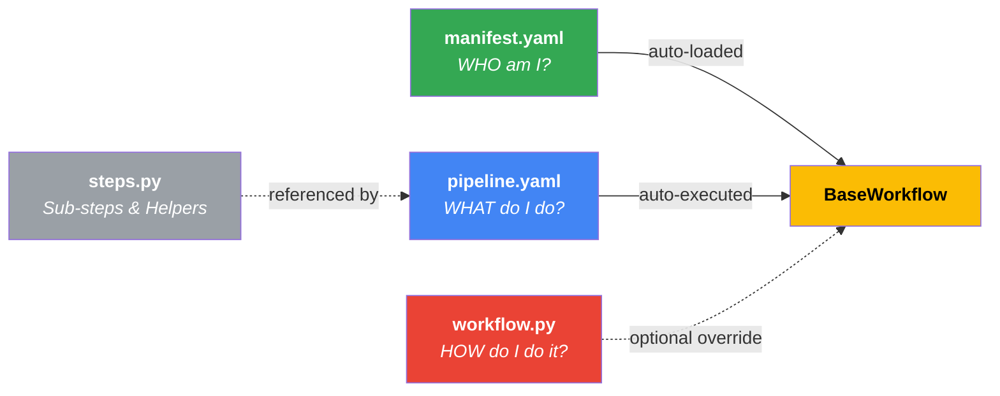

# Autopilot Architecture Standards — "The Edge"

> [!IMPORTANT]
> This document is the **SINGLE SOURCE OF TRUTH** for all architectural decisions in this codebase.
> **ALL** code generation and refactoring MUST align with these standards.

## 1. Core Philosophy: "Edge" & "Agentic"

We build **World-Class, Edge-First, Agentic Systems**.

- **Headless API Topology**: The system is a pure backend API (JSON/Events). There is **NO** internal frontend or dashboard. All interactions occur via strictly secured API endpoints (`X-API-Key`) or trusted Webhooks (Pub/Sub).
- **Edge-First**: Logic should run as close to the data/user as possible. We use lightweight, efficient patterns without monolithic state.
- **Agentic**: The system is composed of autonomous, intelligent agents that interact via standard protocols.
- **Google ADK Alignment**: We strictly follow the Google Agent Development Kit (ADK) patterns.

## 2. Agent Creation Standards

### The "Factory" Pattern

⛔️ **NEVER** instantiate `LlmAgent` or `Agent` classes directly in workflow code.
✅ **ALWAYS** use the platform factory function: `create_platform_agent`.

**Why?**

- Enforces standardized observability (logging, tracing).
- Ensures consistent error handling.
- Applies uniform default configurations (models, safety settings).

**Example:**

```python
from autopilot.agents.base import create_platform_agent

# CORRECT
agent = create_platform_agent(
    name="my_agent",
    instruction="Do the thing",
    model="gemini-3-flash-preview",
    fallback_model="gemini-2.0-pro-exp",  # Platform handles resilience automatically
    tools=[my_tool]
)

# WRONG
agent = LlmAgent(name="my_agent", ...)  # ❌ PROHIBITED
```

### Agent Cards

Every agent MUST have a corresponding definition in an `.agent.yaml` file (Agent Card).

- **Location**: Co-located with the agent code (e.g., `workflows/my_workflow/agents/my_agent.agent.yaml`).
- **Purpose**: Defines metadata, input/output schemas, and testing configurations declaratively.

### Agent Guardrails (`autopilot.agents.guardrails`)

⛔️ **NEVER** implement guardrail callbacks directly in workflow code.
✅ **ALWAYS** use the platform guard factories and compose them via `create_chained_before_callback` / `create_chained_after_callback`.

**Why?**

- Eliminates code duplication (e.g., `_extract_response_text` helpers).
- Guards are configurable via parameters — only the threshold values are domain-specific.
- Consistent logging and response formatting across all agents.

| Guard Factory            | Type     | Purpose                                           | Key Parameters                  |
| ------------------------ | -------- | ------------------------------------------------- | ------------------------------- |
| `input_length_guard`     | `before` | Reject inputs shorter than `min_chars`            | `min_chars`, `message`          |
| `prompt_injection_guard` | `before` | Detect prompt injection via regex patterns        | `patterns`, `message`           |
| `uuid_format_guard`      | `after`  | Validate UUID format in JSON output fields        | `fields` (tuple of field names) |
| `amount_sanity_guard`    | `after`  | Block outputs with amounts exceeding `max_amount` | `max_amount` (required)         |

**Example:**

```python
from autopilot.agents.guardrails import (
    input_length_guard,
    prompt_injection_guard,
    uuid_format_guard,
    amount_sanity_guard,
)
from autopilot.agents.callbacks import (
    create_chained_before_callback,
    create_chained_after_callback,
)

agent = create_platform_agent(
    name="email_parser",
    instruction="...",
    before_model_callback=create_chained_before_callback(
        input_length_guard(min_chars=10),
        prompt_injection_guard(),
    ),
    after_model_callback=create_chained_after_callback(
        amount_sanity_guard(max_amount=50_000_000),  # COP threshold
        uuid_format_guard(),
    ),
)
```

**Workflow-Specific Guards:**

Guards that depend on **domain-specific fields** (e.g., `payee`, `category_name`) belong in the workflow's own `agents/guardrails.py`, not at the platform level. These guards follow the same factory pattern but are scoped to a single workflow.

```python
# workflows/bank_to_ynab/agents/guardrails.py
from workflows.bank_to_ynab.agents.guardrails import semantic_coherence_guard

agent = create_platform_agent(
    name="categorizer",
    after_model_callback=create_chained_after_callback(
        semantic_coherence_guard(rules=rules),  # Domain: payee↔category
        uuid_format_guard(fields=("category_id",)),  # Platform: UUID format
    ),
)
```

> [!CAUTION]
> **Platform guards** = generic, reusable across any workflow (input validation, injection, UUID format, amount limits).
> **Workflow guards** = domain-specific, depend on workflow model fields. Keep them in `<workflow>/agents/guardrails.py`.
> Never duplicate platform guard logic in a workflow.

## 3. Core Primitives (`autopilot.core`)

The platform provides typed, observable primitives for building agentic workflows:

| Primitive                 | Purpose                                                                          |
| ------------------------- | -------------------------------------------------------------------------------- |
| `AgentContext`            | Execution context (logger, events, state, session, memory, tools)                |
| `BaseAgent[In, Out]`      | Strictly typed agent contract with `invoke()` lifecycle                          |
| `FunctionalAgent`         | Auto-wraps plain Python functions as agents                                      |
| `ADKAgent`                | Bridges Google ADK `LlmAgent` into the platform contract (state-priority output) |
| `SequentialAgentAdapter`  | Runs child agents in sequence, accumulating state (ADK `SequentialAgent`)        |
| `LoopAgentAdapter`        | Retries a body agent until exit condition met (ADK `LoopAgent`)                  |
| `ParallelAgentAdapter`    | Runs branches concurrently via `asyncio.gather` (ADK `ParallelAgent`)            |
| `FallbackAgentAdapter`    | Retries a primary agent, falling back to a secondary on error                    |
| `PipelineBuilder`         | Fluent API: `.step()`, `.loop()`, `.parallel()`                                  |
| `Pipeline`                | Sequential execution engine with full observability and HITL support             |
| `DAGBuilder`              | Fluent API for directed acyclic graph construction                               |
| `DAGRunner`               | Topological parallel execution engine                                            |
| `ReactRunner`             | Agentic Reason-Act-Observe orchestration loop                                    |
| `RouterRunner`            | Semantic routing to sub-workflows based on intent                                |
| `OrchestrationStrategy`   | Enum: `SEQUENTIAL`, `DAG`, `REACT`, `ROUTER`                                     |
| `BaseSessionService`      | ABC for short-term KV state scoped to an execution                               |
| `InMemorySessionService`  | Dict-backed session (auto-provisioned in `AgentContext`)                         |
| `RedisSessionService`     | Redis-backed distributed session state for edge deployments                      |
| `BaseMemoryService`       | ABC for long-term semantic memory across executions                              |
| `InMemoryMemoryService`   | TF-IDF + cosine similarity memory (zero external deps)                           |
| `ChromaMemoryService`     | Persistent vector DB memory via ChromaDB                                         |
| `Observation`             | A single memory record with text, metadata, timestamp, and relevance             |
| `ToolRegistry`            | Centralized tool registry with `@tool` decorator and lazy connector resolution   |
| `ToolInfo`                | Pydantic metadata model for registered tools (incl. `requires_context`)          |
| `ToolCallbackManager`     | Before/after lifecycle hooks for tool invocations                                |
| `ToolAuthConfig`          | Declarative per-tool credential configuration                                    |
| `ToolAuthManager`         | Credential store: resolution (cache→state→env), request/provide flows            |
| `LongRunningTool`         | Wrapper for async operations → ADK `LongRunningFunctionTool`                     |
| `OperationTracker`        | Lifecycle tracking for long-running tool operations                              |
| `MCPBridge`               | Platform wrapper for connecting to external MCP servers                          |
| `MCPRegistry`             | Multi-MCP-server lifecycle management                                            |
| `AgentBus`                | Typed pub/sub message bus for inter-agent communication (A2A)                    |
| `AgentMessage`            | Pydantic envelope: topic, sender, payload, correlation_id                        |
| `Subscription`            | Opaque handle for unsubscribing from the bus                                     |
| `DSLWorkflowDef`          | Pydantic schema for declarative YAML workflow definitions                        |
| `DSLStepDef`              | Schema for a single step (function, agent, loop, parallel, sequential)           |
| `DSLNodeDef`              | Schema for a DAG node with explicit dependencies                                 |
| `load_workflow(path)`     | Reads YAML → validates → resolves refs → returns `Pipeline` or `DAGRunner`       |
| `load_workflow_from_dict` | Same as above but from a pre-parsed dict (useful in tests)                       |

### ADKAgent Output Extraction

`ADKAgent` bridges Google ADK `LlmAgent` into the platform's `BaseAgent` contract. When `output_key` is set on the agent, `ADKAgent.run()` uses **state-priority extraction**:

1. **ADK Session State** (`result.state[output_key]`) — checked first, always reliable
2. **Text Parsing** (`result.parsed_json`) — fallback only when state is empty

> [!WARNING]
> Never rely on text parsing (`parsed_json`) as the primary output path. ADK's native `output_key` writes structured data directly into session state, which is lossless. Text parsing is fragile — it can lose fields (e.g., `category_id`) when the LLM response contains tool calls alongside text.

### Connector Bridge Wrapper Annotations

When `expose_connector_tools()` wraps connector methods as ADK `FunctionTool`s, it copies the original method's `__signature__`, `__annotations__` (resolved via `inspect.get_annotations(eval_str=True)`), and `__module__` to the wrapper function. This ensures ADK can correctly introspect parameter types for the LLM function declaration.

## 4. Pipeline & Orchestration

### Orchestration Strategies

The platform supports **multi-strategy orchestration** via the `OrchestrationStrategy` enum:

| Strategy     | Engine         | Status    | Description                                    |
| ------------ | -------------- | --------- | ---------------------------------------------- |
| `SEQUENTIAL` | `Pipeline`     | ✅ Active | Linear A→B→C execution                         |
| `DAG`        | `DAGRunner`    | ✅ Active | Topological graph with parallel layers         |
| `REACT`      | `ReactRunner`  | ✅ Active | Reasoning + Acting loops with dynamic tool use |
| `ROUTER`     | `RouterRunner` | ✅ Active | LLM-based routing to best-fit sub-workflow     |

### Rules

⛔️ **NEVER** write imperative glue code (manual `try/except`, logging, state passing) in orchestrators.
✅ **ALWAYS** use `PipelineBuilder` or `DAGBuilder` to define flows.

**Why?**

- **Observability**: The platform automatically traces every step/node.
- **Resilience**: The runtime handles retries, state persistence, and error recovery.
- **Consistency**: All workflows look and behave the same.

### Sequential Pipeline (Default)

```python
from autopilot.core import PipelineBuilder, AgentContext

pipeline = (
    PipelineBuilder("bank_to_ynab")
    .step(format_parser_prompt)          # Code function → FunctionalAgent
    .step(create_email_parser(model))    # ADK LlmAgent → ADKAgent
    .step(match_account)                 # Code function → FunctionalAgent
    .step(format_categorizer_input)      # Code function → FunctionalAgent
    .step(create_categorizer(model))     # ADK LlmAgent → ADKAgent
    .step(synthesize_transaction)        # Code function → FunctionalAgent
    .step(push_to_ynab)                  # Code function → FunctionalAgent
    .build()
)

ctx = AgentContext(pipeline_name="bank_to_ynab")

result = await pipeline.execute(
    ctx, initial_input={
        "email_body": raw_email,
        "auto_create": True,
    }
)
```

### Composition Patterns

The `PipelineBuilder` supports advanced ADK-aligned composition via `.loop()` and `.parallel()`:

```python
pipeline = (
    PipelineBuilder("advanced_workflow")
    # Retry parsing until valid, max 3 attempts
    .loop(
        parser_agent,
        condition=lambda s: s.get("valid", False),
        max_iterations=3,
    )
    # Fetch from multiple sources concurrently
    .parallel(api1_agent, api2_agent, name="fetch_all")
    # Final synthesis step
    .step(synthesizer_agent)
    .build()
)
```

| Method                                         | Pattern                        | ADK Equivalent         |
| ---------------------------------------------- | ------------------------------ | ---------------------- |
| `.step(agent)`                                 | Sequential single step         | `SequentialAgent`      |
| `.loop(body, condition=..., max_iterations=N)` | Retry loop with exit condition | `LoopAgent` + escalate |
| `.parallel(*branches)`                         | Concurrent fan-out → merge     | `ParallelAgent`        |

> [!NOTE]
> All composition adapters inherit from `BaseAgent` and use the platform's `invoke()` lifecycle,
> so observability (events, logging, tracing) works automatically at every level of nesting.

### DAG Orchestration (Phase 2)

For workflows with complex dependency graphs where independent branches can execute in parallel:

```python
from autopilot.core import DAGBuilder, AgentContext

dag = (
    DAGBuilder("analytics")
    .node("fetch_data", fetch_agent)
    .node("analyze_text", text_agent, dependencies=["fetch_data"])
    .node("analyze_images", image_agent, dependencies=["fetch_data"])
    .node("merge_report", merger, dependencies=["analyze_text", "analyze_images"])
    .build()
)

result = await dag.execute(ctx, initial_input={...})
```

**Key features:**

- **Topological sorting** via Kahn's algorithm — determines execution order automatically
- **Layer-based parallelism** — nodes without mutual dependencies run concurrently via `asyncio.gather`
- **Build-time validation** — detects cycles (`DAGCycleError`), dangling deps (`DAGDependencyError`), and duplicates before execution
- **Auto-wrapping** — plain functions and ADK agents are wrapped into `BaseAgent`, same as `PipelineBuilder`

**Execution model (diamond DAG example):**

```
Layer 0: [fetch_data]                    ← sequential root
Layer 1: [analyze_text, analyze_images]  ← parallel
Layer 2: [merge_report]                  ← waits for both
```

### ReAct Orchestration (Phase 2)

For dynamic agentic loops where the number of steps is unknown upfront:

```python
from autopilot.core.react import ReactRunner

runner = ReactRunner("dynamic_agent", agent)
result = await runner.execute(ctx, initial_input={"user_prompt": "Research X and summarize."})
```

**Key features:**

- Loops until the agent outputs `react_finished: True` in its state.
- Highly resilient to formatting/tool errors with built-in retry escalation.

### Router Orchestration (Phase 2)

Semantic routing layer to map user intent to specific sub-engines dynamically:

```python
from autopilot.core.router import RouterRunner

runner = RouterRunner(
    "main_router",
    router_agent=intent_classifier_agent,
    routes={
        "refunds": refund_pipeline,
        "support": support_dag,
    },
    default_route="support",
)
result = await runner.execute(ctx, initial_input={"message": "I want my money back"})
```

### Human-In-The-Loop (HITL)

Pipelines support execution pausing for human review. If an agent or tool injects `hitl_requested: True` into the state, the pipeline suspends execution, returning `paused=True`.
A webhook or external service can resume the context, and the pipeline correctly skips previously executed steps.

```python
# Run 1: Pauses midway
ctx.state["hitl_requested"] = True
result1 = await pipeline.execute(ctx) # paused=True

# Wait for human approval via webhook...
ctx.state["hitl_approved"] = True

# Run 2: Resumes precisely where it left off
result2 = await pipeline.execute(ctx, initial_input=resumed_state)
```

### BaseWorkflow Strategy Support

Workflows declare their strategy via the `strategy` property. Default is `SEQUENTIAL`:

```python
class MyDagWorkflow(BaseWorkflow):
    @property
    def strategy(self):
        return OrchestrationStrategy.DAG

    def build_dag(self):
        return (
            DAGBuilder("my_dag")
            .node("a", agent_a)
            .node("b", agent_b, dependencies=["a"])
            .build()
        )
```

### Session & Memory Layer (Stateless Edge Backends)

Every `AgentContext` includes **session** (short-term KV state) and **memory** (long-term semantic recall).

- In development, they default to `InMemorySessionService` and `InMemoryMemoryService`.
- **In production** on edge environments (Cloud Run, K8s), they must be swapped to the clustered variants: `RedisSessionService` and `ChromaMemoryService` to prevent state loss across ephemeral container routing.

```python
from autopilot.core import AgentContext, InMemoryMemoryService

# Auto-provisioned — just works
ctx = AgentContext(pipeline_name="bank_to_ynab")

# Inside any agent:
async def run(self, ctx, input):
    # Short-term session: share state within a pipeline run
    await ctx.session.set("user_timezone", "EST")
    tz = await ctx.session.get("user_timezone")

    # Long-term memory: persist observations across executions
    await ctx.remember("User prefers dark mode", {"agent": self.name})
    results = await ctx.recall("theme preferences", top_k=3)
```

**Shared memory across pipeline runs:**

```python
# Inject a shared memory service to persist across executions
shared_memory = InMemoryMemoryService()

# Run 1: Agent saves
ctx1 = AgentContext(pipeline_name="run_1", memory=shared_memory)
await pipeline.execute(ctx1, initial_input={...})

# Run 2: Different agent recalls
ctx2 = AgentContext(pipeline_name="run_2", memory=shared_memory)
results = await ctx2.recall("previous transactions")
```

| Component              | Purpose                                               |
| ---------------------- | ----------------------------------------------------- |
| `BaseSessionService`   | ABC — swap with `RedisSessionService` for prod        |
| `BaseMemoryService`    | ABC — swap with ChromaDB or Vertex AI Search for prod |
| `ctx.remember(text)`   | Convenience → `memory.add_observation()`              |
| `ctx.recall(query)`    | Convenience → `memory.search_relevant()`              |
| `ctx.session.get/set`  | Direct KV access on the session service               |
| `ctx.tools`            | Access the global `ToolRegistry` from any agent       |
| `ctx.bus`              | Access the global `AgentBus` for A2A messaging        |
| `ctx.publish(topic)`   | Convenience → `bus.publish()` with auto-sender        |
| `ctx.subscribe(topic)` | Convenience → `bus.subscribe()`                       |

### Scale-to-Zero and Long-Lived Subscriptions

Cloud Run deployments use **scale-to-zero** (`min-instances=0`) for cost efficiency. This has severe implications for long-lived components like the `PubSubConnector`'s Gmail Watch renewal loop. When the instance scales to zero, in-memory background tasks are killed.

**The Deadlock Problem:**

1. Instance scales to zero, killing the in-process renewal loop.
2. Watch expires (e.g. 7 days later).
3. Gmail stops sending Pub/Sub notifications.
4. No notifications → no HTTP requests → instance never wakes up → watch never renews.

**The Architectural Solution (Keep-Alive Pattern & Exclusivity):**
Scale-to-zero engines **must** rely on external, managed schedulers to keep time-sensitive subscriptions alive, and must forcefully prioritize production execution.

1. **Idempotent Setup**: The connector's `setup()` method must idempotently re-register the watch on _every_ cold start.
2. **HTTP Renew Endpoint**: The platform exposes `POST /gmail/watch/renew`.
3. **Cloud Scheduler**: A Google Cloud Scheduler job is configured to ping the renew endpoint periodically (e.g., every 6 days for a 7-day watch), forcing the instance to wake up and execute the renewal logic, breaking the deadlock permanently.
4. **Auto-Recovery (Watch Stealing)**: Gmail allows only one push notification webhook per developer account. If `watch()` throws an `"Only one user push notification client allowed"` error (which usually happens when a developer tests locally and locks the topic), the production connector **intercepts** this error, calls `stop()` natively to "steal" back exclusivity, and retries the registration. This ensures zero downtime in production regardless of local testing.

### Tool Ecosystem (Phase 4)

The `ToolRegistry` centralizes reusable tools so any LLM agent can discover and invoke them without manual wiring.

#### Registering custom logic with `@tool`

Use `@tool` **ONLY** for workflow-specific custom logic (e.g., custom parsers, specific business rules, local DB lookups).

```python
from autopilot.core.tools import tool

@tool(tags=["finance", "ynab"])
async def calculate_custom_tax(amount: float, category: str) -> dict:
    """Calculate specific tax rules for a transaction."""
    ...
```

> [!CAUTION]
> **NEVER** use `@tool` in workflow code to wrap connector methods (like `ynab.create_transaction` or `gmail.send_email`).
> The platform auto-exposes `BaseConnector` methods natively via `expose_connector_tools()`.
> Wrapping them manually in workflows creates identical double implementations and disconnects the tool from platform observability and callback rules.

#### Lazy Connector Tool Auto-Resolution

Connector tools are auto-resolved **lazily** by the `ToolRegistry` at first reference. When an agent declares `tools=["ynab.get_categories_string"]`, the registry:

1. Detects the `connector.method` naming pattern
2. Fetches the connector from `ConnectorRegistry`
3. Calls `expose_connector_tools()` to register **all** methods for that connector
4. Returns the now-registered tool

This is **idempotent** — subsequent references to the same connector are instant lookups.

```python
# Agents simply reference connector tools by name — no manual registration needed.
agent = create_platform_agent(
    name="categorizer",
    instruction="...",
    tools=["ynab.get_categories_string"],  # Auto-resolved on first use
)
```

> [!IMPORTANT]
> You do **NOT** need to call `expose_connector_tools()` manually. The `ToolRegistry._select()` method handles lazy resolution automatically when it encounters a `connector.method` name that isn't yet registered. This works regardless of app startup order (FastAPI, CLI, tests, standalone scripts).

For advanced cases where you need **explicit** registration (e.g., exposing only specific methods):

```python
from autopilot.connectors import get_connector_registry
from autopilot.core.tools import expose_connector_tools

ynab = get_connector_registry().get("ynab")
expose_connector_tools(ynab, methods=["get_accounts", "create_transaction"])
```

#### Injecting tools into agents

⛔️ **NEVER** import `get_tool_registry()` or other tool retrieval methods inside your workflow agents. The platform enforces strict edge/platform decoupling.
✅ **ALWAYS** pass tools as an array of string references (e.g., `["search_web", "ynab.create_transaction"]`). The platform auto-resolves them under the hood during agent creation.

```python
agent = create_platform_agent(
    name="research_agent",
    instruction="...",
    tools=["search_web", "my_custom_tool", "ynab.get_accounts"],
)
```

#### Connecting MCP servers

```python
from autopilot.core.tools import MCPBridge, MCPRegistry

mcp = MCPRegistry()
mcp.register(MCPBridge(
    server_name="brave_search",
    command="npx",
    args=["-y", "@anthropic/mcp-brave-search"],
    env={"BRAVE_API_KEY": "..."},
))

# Add MCP toolsets to an agent
agent = create_platform_agent(
    name="research_agent",
    instruction="...",
    tools=mcp.get_all_toolsets(),
)
```

| Component                     | Purpose                                                         |
| ----------------------------- | --------------------------------------------------------------- |
| `@tool` decorator             | Register a function + extract metadata at import time           |
| `ToolRegistry.to_adk_tools()` | Batch-convert to ADK `FunctionTool` / `LongRunningFunctionTool` |
| `ToolRegistry.by_tag(tag)`    | Filter tools by tag (e.g. `"finance"`, `"search"`)              |
| `expose_connector_tools()`    | Auto-expose connector `.client` methods as namespaced tools     |
| `MCPBridge`                   | Config + factory for a single MCP server connection             |
| `MCPRegistry`                 | Manages multiple MCP bridges and batch-retrieves toolsets       |

#### ToolContext Integration (Phase 7)

Tools can accept ADK's `ToolContext` for access to session state, memory, authentication, and artifacts. The platform **auto-detects** this:

```python
from google.adk.tools import ToolContext
from autopilot.core.tools import tool

@tool(tags=["finance"])
async def create_transaction(
    budget_id: str, amount: float, tool_context: ToolContext
) -> dict:
    """Create a YNAB transaction with session-aware auth."""
    api_key = tool_context.state.get("ynab_api_key")
    # tool_context is auto-injected by ADK — never included in user-facing params
    ...
```

- `ToolInfo.requires_context` is set to `True` automatically when `tool_context` is in the function signature
- `to_adk_tools()` passes functions through to `FunctionTool` — ADK handles injection natively
- `tool_context` is excluded from `ToolInfo.parameters` (not user-facing)

#### Tool Lifecycle Callbacks (Phase 7)

Before/after hooks that intercept every tool invocation for guardrails, rate limiting, audit logging, and auth checks:

```python
from autopilot.core.tools import get_callback_manager, create_rate_limit_callback

mgr = get_callback_manager()

# Built-in: rate limit a specific tool
mgr.register_before(
    create_rate_limit_callback(max_calls=10, window_seconds=60),
    tools=["ynab.create_transaction"],
)

# Custom: audit log all tool calls
@mgr.after
async def audit(tool_name, args, result, context):
    logger.info("tool_executed", tool=tool_name)
    return result  # Pass through
```

| Component                    | Purpose                                                   |
| ---------------------------- | --------------------------------------------------------- |
| `ToolCallbackManager`        | Manages ordered before/after hook chains                  |
| `@mgr.before` / `@mgr.after` | Decorator syntax for hook registration                    |
| `create_rate_limit_callback` | Factory for per-tool rate limiting (sliding window)       |
| `audit_log_callback`         | Built-in after-hook for structured audit logging          |
| `auth_check_callback`        | Built-in before-hook that verifies `required_auth` in ctx |

#### Tool Authentication Framework (Phase 7)

Declarative credential management with resolution chain (`cache → session state → env vars`):

```python
from autopilot.core.tools import ToolAuthConfig, get_auth_manager

manager = get_auth_manager()
manager.register(ToolAuthConfig(
    tool_name="ynab.create_transaction",
    auth_type="api_key",
    credential_key="YNAB_API_TOKEN",
))

# At runtime — resolution chain: cache → state → env
cred = manager.get_credential("ynab.create_transaction", state=ctx.state)

# Human-in-the-loop: request missing credentials
if cred is None:
    request = manager.request_credential("ynab.create_transaction")
    # Returns: {"status": "auth_required", "auth_type": "api_key", ...}
```

| Component         | Purpose                                                    |
| ----------------- | ---------------------------------------------------------- |
| `ToolAuthConfig`  | Frozen dataclass: tool_name, auth_type, credential_key     |
| `AuthCredential`  | Resolved credential with token, scopes, metadata           |
| `ToolAuthManager` | Register configs, resolve/cache credentials, request flows |

#### Long-Running Tools (Phase 7)

For operations that take time (batch processing, approval flows, webhooks):

```python
from autopilot.core.tools import long_running_tool, get_operation_tracker

@long_running_tool(tags=["finance", "batch"])
def create_batch_transactions(transactions: list[dict]) -> dict:
    """Create multiple YNAB transactions in batch."""
    tracker = get_operation_tracker()
    op = tracker.create("batch_transactions")
    # Start async processing...
    return {"status": "pending", "operation_id": op.operation_id}

# to_adk_tools() automatically wraps these with LongRunningFunctionTool
```

| Component            | Purpose                                              |
| -------------------- | ---------------------------------------------------- |
| `LongRunningTool`    | Wrapper → ADK `LongRunningFunctionTool`              |
| `@long_running_tool` | Decorator (auto-registers with `long_running` tag)   |
| `OperationTracker`   | In-memory lifecycle: create → running → completed    |
| `OperationStatus`    | Dataclass: operation_id, status, result, error, time |

### Agent Bus — A2A Communication (Phase 5)

The `AgentBus` provides typed, async pub/sub messaging for decoupled inter-agent communication. Any agent can publish events and any number of subscribers receive them concurrently.

#### Publishing & Subscribing

```python
from autopilot.core import AgentBus, get_agent_bus

bus = get_agent_bus()

# Subscribe (supports wildcards: "agent.*", "*", "agent.?")
async def on_error(msg):
    print(f"Error from {msg.sender}: {msg.payload}")

sub = bus.subscribe("agent.*", on_error)

# Publish
await bus.publish("agent.error", {"detail": "timeout"}, sender="parser")

# Unsubscribe
bus.unsubscribe(sub)
```

#### Context Convenience (inside any agent)

```python
async def run(self, ctx, input):
    # Subscribe to all agent events
    ctx.subscribe("agent.*", self.handle_event)

    # Publish with auto-sender (pipeline_name)
    await ctx.publish("agent.completed", {"result": "ok"})

    # Access history for debugging
    recent = ctx.bus.history("agent.error", limit=10)
```

| Feature                   | Description                                                  |
| ------------------------- | ------------------------------------------------------------ |
| **Wildcard topics**       | `fnmatch` patterns: `"agent.*"`, `"*.error"`, `"?"`          |
| **Dead-letter isolation** | Handler exceptions are logged, never block other subscribers |
| **Per-topic history**     | Ring buffer (`deque(maxlen=100)`) for replay/debug           |
| **Concurrent dispatch**   | Handlers run via `asyncio.gather` per publish call           |
| **Singleton**             | `get_agent_bus()` / `reset_agent_bus()`                      |

### Declarative DSL — YAML Workflows (Phase 6)

Define workflows **100% in YAML** — no Python required. The `DSLLoader` reads YAML, validates via Pydantic, resolves dotted import paths via `importlib`, and produces executable `Pipeline` or `DAGRunner` objects.

#### Sequential workflow

```yaml
name: my_workflow
strategy: sequential
steps:
  - name: parse
    type: function
    ref: mymodule.parse_input

  - name: validate
    type: loop
    max_iterations: 3
    condition_expr: "state.get('valid', False)"
    body:
      name: check
      type: function
      ref: mymodule.validate_data

  - name: enrich
    type: parallel
    children:
      - name: a
        type: function
        ref: mymodule.fetch_a
      - name: b
        type: function
        ref: mymodule.fetch_b
```

#### DAG workflow

```yaml
name: analytics
strategy: dag
nodes:
  - name: fetch
    ref: mymodule.fetch_agent
  - name: text_analysis
    ref: mymodule.text_analyzer
    dependencies: [fetch]
  - name: image_analysis
    ref: mymodule.image_analyzer
    dependencies: [fetch]
  - name: merge
    ref: mymodule.merger
    dependencies: [text_analysis, image_analysis]
```

#### Loading and executing

```python
from autopilot.core import load_workflow

pipeline = load_workflow("workflows/my_flow/workflow.yaml")
result = await pipeline.execute(initial_input={"raw_text": "hello"})
```

| Step Type  | YAML `type`  | Maps To                  | Required Fields                            |
| ---------- | ------------ | ------------------------ | ------------------------------------------ |
| Function   | `function`   | `FunctionalAgent`        | `ref` (dotted import path)                 |
| Agent      | `agent`      | `BaseAgent` subclass     | `ref`                                      |
| Loop/Retry | `loop`       | `LoopAgentAdapter`       | `body`, `condition_expr`, `max_iterations` |
| Parallel   | `parallel`   | `ParallelAgentAdapter`   | `children` (list of sub-steps)             |
| Sequential | `sequential` | `SequentialAgentAdapter` | `children` (list of sub-steps)             |

> [!NOTE]
> **Callable Resolution**: The DSLLoader uses `inspect.signature` to intelligently differentiate between **plain functions** (requires arguments like `ctx` or `state`) and **agent factories** (takes no required arguments). This ensures pure functions are safely wrapped as a `FunctionalAgent` and are **never** executed prematurely during workflow formulation.
>
> `condition_expr` strings are sandboxed: only `state` is in scope, `__builtins__` are stripped.
> Example: `"state.get('counter', 0) >= 3"`

## 5. Observability & Telemetry

A true tier-1 agentic system must have perfect visibility into non-deterministic LLM behavior.
The platform features **native OpenTelemetry (OTel)** tracing embedded deep within the execution engines.

- **`PipelineRunner` & Engines**: Emits spans capturing execution hierarchical steps, timing, and errors.
- **`BaseAgent`**: Emits spans (`agent.invoke`) tracking individual agent runs.
- **`AgentBus`**: Automatically injects trace correlation IDs when publishing messages, capturing concurrent subscriber deliveries and failure states.

## 6. Error Taxonomy

Structured, typed exceptions across all platform layers:

| Layer     | Error                     | Retryable | Code                   |
| --------- | ------------------------- | --------- | ---------------------- |
| Pipeline  | `PipelineTimeoutError`    | ✅        | `PIPELINE_TIMEOUT`     |
| Pipeline  | `MaxRetriesExceededError` | ❌        | `MAX_RETRIES_EXCEEDED` |
| DAG       | `DAGCycleError`           | ❌        | `DAG_CYCLE`            |
| DAG       | `DAGDependencyError`      | ❌        | `DAG_DEPENDENCY`       |
| Agent     | `LLMRateLimitError`       | ✅        | `LLM_RATE_LIMIT`       |
| Agent     | `AgentOutputParseError`   | ✅        | `AGENT_OUTPUT_PARSE`   |
| Connector | `ConnectorAuthError`      | ❌        | `CONNECTOR_AUTH`       |
| Guardrail | `GuardrailBlockedError`   | ❌        | `GUARDRAIL_BLOCKED`    |
| Session   | `SessionError`            | ❌        | `SESSION_ERROR`        |
| Memory    | `MemoryServiceError`      | ❌        | `MEMORY_ERROR`         |
| Tools     | `ToolRegistryError`       | ❌        | `TOOL_REGISTRY_ERROR`  |
| Tools     | `MCPBridgeError`          | ✅        | `MCP_BRIDGE_ERROR`     |
| Tools     | `ToolCallbackError`       | ❌        | `TOOL_CALLBACK_ERROR`  |
| Tools     | `ToolAuthError`           | ❌        | `TOOL_AUTH_ERROR`      |
| Bus       | `BusError`                | ❌        | `BUS_ERROR`            |
| Bus       | `BusTimeoutError`         | ✅        | `BUS_TIMEOUT`          |
| DSL       | `DSLValidationError`      | ❌        | `DSL_VALIDATION`       |
| DSL       | `DSLResolutionError`      | ❌        | `DSL_RESOLUTION`       |

## 7. Directory Structure

```
autopilot/                        # Core platform logic
├── core/                         # Primitives (AgentContext, BaseAgent, Pipeline, DAG, Session, Memory, Tools, DSL)
│   ├── agent.py                  # BaseAgent, FunctionalAgent, FallbackAgentAdapter
│   ├── pipeline.py               # Pipeline, PipelineBuilder
│   ├── dag.py                    # DAGBuilder, DAGRunner
│   ├── react.py                  # ReactRunner
│   ├── router.py                 # RouterRunner
│   ├── orchestrator.py           # OrchestrationStrategy enum
│   ├── session.py                # RedisSessionService, InMemorySessionService
│   ├── memory.py                 # ChromaMemoryService, InMemoryMemoryService
│   ├── context.py                # AgentContext (session, memory, tools, bus auto-provisioned)
│   ├── bus.py                    # V3 Phase 5 — AgentBus, AgentMessage, Subscription
│   ├── dsl_schema.py             # V3 Phase 6 — DSLWorkflowDef, DSLStepDef, DSLNodeDef
│   ├── dsl_loader.py             # V3 Phase 6 — load_workflow(), ref resolution, condition compiler
│   └── tools/                    # Tool Ecosystem (Phase 4 + Phase 7)
│       ├── registry.py           # ToolRegistry, @tool decorator, ToolInfo (requires_context)
│       ├── connector_bridge.py   # Auto-expose connector methods as tools
│       ├── mcp.py                # MCPBridge, MCPRegistry
│       ├── callbacks.py          # Phase 7 — ToolCallbackManager, before/after hooks
│       ├── auth.py               # Phase 7 — ToolAuthConfig, ToolAuthManager, credential flows
│       └── long_running.py       # Phase 7 — LongRunningTool, OperationTracker
├── agents/                       # ADK bridge, callbacks, guardrails
│   ├── base.py                  # create_platform_agent factory
│   ├── callbacks.py             # before/after model callback chaining
│   ├── tool_callbacks.py        # before/after tool callback logging
│   └── guardrails.py            # Platform guard factories (input_length, injection, uuid, amount)
├── connectors/                   # External service integrations
├── base_workflow.py              # BaseWorkflow (auto-loads manifest + pipeline)
├── errors.py                     # Structured error taxonomy
├── registry.py                   # WorkflowRegistry (3-level auto-discovery)
├── cli.py                        # CLI for scaffolding workflows
└── router.py                     # WorkflowRouter
workflows/                        # Business logic, separated by domain
├── <name>/
│   ├── manifest.yaml             # A2A metadata, triggers, settings (required)
│   ├── pipeline.yaml             # DSL pipeline definition (optional)
│   ├── workflow.py               # BaseWorkflow subclass (optional)
│   ├── steps.py                  # Pipeline step functions (optional)
│   ├── agents/                   # Agent implementations + Cards
│   │   ├── guardrails.py        # Workflow-specific domain guards (optional)
│   │   └── *.py                 # Agent factory functions
│   ├── models/                   # Pydantic data models
│   ├── data/                     # Business data files (JSON/YAML, no code)
│   └── tests/                    # Workflow-specific tests
tests/                            # Platform-level tests
```

### Workflow Creation Levels

| Level         | Files Required                              | Python LOC | Use Case            |
| ------------- | ------------------------------------------- | ---------- | ------------------- |
| **Pure YAML** | `manifest.yaml` + `pipeline.yaml`           | 0          | Simple pipelines    |
| **Minimal**   | `manifest.yaml` + `workflow.py`             | ~10        | Custom execute()    |
| **Full**      | `manifest.yaml` + `workflow.py` + `agents/` | As needed  | Complex multi-agent |

### Separation of Concerns — The Three-File Architecture

Every workflow is composed of **at most three core files** (plus optional supplemental files like `steps.py`), each with a single, strict responsibility. This is the foundational principle — violating it leads to coupling, duplication, and corrupted protocols.



#### 1. `manifest.yaml` — WHO am I? (Identity & Discovery)

> **Owner**: A2A Protocol / Google ADK Agent Cards
> **Required**: ✅ Always

The manifest is the workflow's **public identity**. It answers: "What is this workflow, how is it triggered, and what does it need?"

| Field              | Purpose                                                       |
| ------------------ | ------------------------------------------------------------- |
| `name`             | Unique snake_case identifier                                  |
| `display_name`     | Human-readable label for logs and API clients                 |
| `description`      | What this workflow does (A2A discovery)                       |
| `version`          | Semantic version for compatibility tracking                   |
| `icon` / `color`   | UI presentation metadata                                      |
| `triggers`         | HOW this workflow is activated (webhook, email, cron, manual) |
| `settings`         | Required configuration and secrets                            |
| `agents.cards_dir` | Path to `.agent.yaml` cards for A2A                           |
| `tags`             | Categorization for filtering                                  |

> [!CAUTION]
> **NEVER** put execution logic, pipeline steps, function references, or orchestration strategy in `manifest.yaml`.
> This file is consumed by the A2A protocol for agent-to-agent discovery. Corrupting its schema breaks interoperability.

#### 2. `pipeline.yaml` — WHAT do I do? (Declarative Execution)

> **Owner**: DSL Engine (`autopilot.core.dsl_loader`)
> **Required**: ⚡ Optional (only if using declarative pipelines)

The pipeline defines the workflow's **execution graph** declaratively. It answers: "What steps run, in what order, with what strategy?"

```yaml
name: bank_pipeline
strategy: sequential # sequential | dag

steps:
  - name: parse_email
    type: function
    ref: workflows.bank_to_ynab.steps.parse_email

  - name: categorize
    type: agent # LLM agent step
    ref: workflows.bank_to_ynab.agents.categorizer

  - name: validate
    type: function
    ref: workflows.bank_to_ynab.steps.validate_transaction
```

Key properties:

- **`strategy`**: How steps relate — `sequential` (A→B→C) or `dag` (topological graph)
- **`steps[].ref`**: Python dotted path to a function or agent, resolved via `importlib`
- **`steps[].type`**: `function` (pure code) | `agent` (LLM) | `loop` | `parallel`

If `pipeline.yaml` exists, `BaseWorkflow.execute()` auto-loads and runs it. No Python needed.

> [!IMPORTANT]
> Pipeline YAML is **internal to the platform**. It is NOT part of the A2A protocol.
> It is consumed only by `BaseWorkflow._execute_dsl_pipeline()` and integrates with `PipelineBuilder` / `DAGBuilder`.

#### 3. `workflow.py` — HOW do I do it? (Imperative Escape Hatch)

> **Owner**: Workflow developer
> **Required**: ✅ Always (As an empty class `pass`), ⚡ Optional (for overriding methods)

The workflow file acts as the **Platform Registry Anchor**. By inheriting from `BaseWorkflow`, the ADK platform's auto-discovery mechanism finds the workflow, loads its `manifest.yaml`, and registers it on the `AgentBus`. Without this file, the workflow does not exist to the engine.

However, its contents should remain **completely empty (`pass`)** unless you need to use the **Imperative Escape Hatch**.

**When to write code in `workflow.py`:**
You only override `BaseWorkflow` methods when the complexity of your use case breaks the limits of what `pipeline.yaml` can express natively:

1. **Advanced Execution Patterns (e.g., Map-Reduce, Complex Loops)**: If your flow requires an infinite `while` loop, or launching parallel pipelines dynamically based on runtime lists. Override `async def execute(self, trigger_data)`.
2. **Dynamic Pipeline Routing**: If your webhook data dictates injecting the state into completely different `pipeline.yaml` definitions (e.g., `refunds.yaml` vs `support.yaml`) depending on the `trigger_data`.
3. **Complex Lifecycle Hooks**: If the flow requires spinning up ephemeral infrastructure, authenticating legacy OAuth, or pre-warming caches _before_ the agents run. Override `async def setup(self)` or `async def teardown(self)`.
4. **Critical Pre/Post-processing**: If the trigger payload needs rigid validation, decryption, or global schema enforcement before entering the agent machinery.

**Example (Pure Declarative / Clean Architecture):**

```python
from autopilot.base_workflow import BaseWorkflow

class BankToYnabWorkflow(BaseWorkflow):
    """
    Identity & Triggers: Loaded natively from manifest.yaml
    Execution Logic: Handled automatically by the DSL via pipeline.yaml
    """
    pass
```

What you **do NOT** need to implement:

- ~~`execute()`~~ → auto-handled by `pipeline.yaml` DSL if it exists
- ~~`manifest` property~~ → auto-loaded from `manifest.yaml`
- ~~`get_agent_cards()`~~ → auto-discovered from `agents/` directory
- ~~`__init__.py` export~~ → registry auto-discovers your class

#### 4. `steps.py` — Pipeline Step Functions (Supplementary)

> **Owner**: Pipeline Engine
> **Required**: ⚡ Optional (only used as helper module for declarative pipelines)

`steps.py` is the designated home for pure Python function steps referenced by `pipeline.yaml` via `type: function`. It answers: "What data transformations step-by-step need to happen between LLM agent invocations?"

- ⛔️ **DO NOT** instantiate pipelines, lookup tools, or orchestrate agents here.
- ✅ **DO** write pure functions using **Pydantic Type Hints**.

**Pydantic Auto-Hydration:**
The declarative pipeline engine (`FunctionalAgent`) automatically reads the Type Hints of your pure functions. If you declare a Pydantic model (`BaseModel`), the engine automatically hydrates the raw dictionaries from the execution state into full Python typed objects before passing them to your function.

> [!CAUTION]
> **Strict Type Enforcement**: The platform will vigorously fail fast with a `pydantic.ValidationError` if the upstream state does not match your downstream schema.
> ⛔️ **DO NOT** write defensive step functions using `Optional[Model] = None` and `**state` fallback dictionary unpacking.
> ✅ **ALWAYS** explicitly demand the fully hydrated object.

```python
# workflows/my_flow/steps.py
from pydantic import BaseModel

class ParsedEmail(BaseModel):
    payee: str
    amount: float

# CORRECT: Strict requirement. Pipeline fails fast if extraction was missing or invalid.
def format_researcher_input(parsed_email: ParsedEmail) -> dict:
    return {"payee": parsed_email.payee}

# WRONG: Technical Debt. Swallows validation errors and forces manual dict lookups.
def format_researcher_input_bad(parsed_email: ParsedEmail | None = None, **state) -> dict: # ❌
    payee = parsed_email.payee if parsed_email else state.get("payee", "")
    return {"payee": payee}
```

#### How `BaseWorkflow` Unifies Everything

`BaseWorkflow` is the **single runtime contract** for all workflows. It auto-resolves files from the workflow directory:

```
BaseWorkflow.__init__()
  └── self._workflow_dir = Path(inspect.getfile(type(self))).parent

BaseWorkflow.manifest  (property)
  └── load_manifest(self._workflow_dir / "manifest.yaml")

BaseWorkflow.execute(trigger_data)
  ├── IF pipeline.yaml exists → self._execute_dsl_pipeline()
  └── ELSE → subclass must override (or raise NotImplementedError)

BaseWorkflow.get_agent_cards()
  └── discover_agent_cards(self._workflow_dir / "agents/")
```

#### Registry Auto-Discovery Chain

The `WorkflowRegistry` scans `workflows/` and loads each workflow using a **fallback chain**:

| Priority | Detection                                 | Behavior                            |
| -------- | ----------------------------------------- | ----------------------------------- |
| 1        | `__init__.py` exports `workflow`          | Use the exported instance (classic) |
| 2        | `workflow.py` has `BaseWorkflow` subclass | Auto-instantiate the class          |
| 3        | `manifest.yaml` exists (no Python)        | Create `BaseWorkflow()` directly    |

This means:

- ⛔️ **No `__init__.py` needed** — auto-discovery handles registration
- ⛔️ **No `workflow` export needed** — the registry finds the class itself
- ✅ Existing workflows with `__init__.py` exports continue to work (backward-compatible)

#### Anti-Patterns

| ❌ Don't                                           | ✅ Do                                  |
| -------------------------------------------------- | -------------------------------------- |
| Put pipeline steps in `manifest.yaml`              | Keep `manifest.yaml` for metadata only |
| Implement `manifest` property in subclass          | Let `BaseWorkflow` auto-load it        |
| Write `__init__.py` with `workflow = MyWorkflow()` | Let registry auto-discover             |
| Duplicate manifest loading code in each workflow   | Inherit from `BaseWorkflow`            |
| Create separate `dsl_example.yaml` files           | Use the `pipeline.yaml` convention     |

## 8. Connectors

Use the **Connector Pattern** for external integrations.

- Do not implement raw API clients inside agents.
- Use `autopilot.connectors` to abstract 3rd party services. Current supported integrations:
  - **YNAB**: `ynab.get_accounts`, `ynab.create_transaction`, etc.
  - **Todoist**: `todoist.get_projects`, `todoist.create_task`, `todoist.get_comments`, etc.
  - **Gmail**: (via Google ADK natively or custom wrappers)
  - **Telegram**: `telegram.send_message`, `telegram.send_photo`, `telegram.set_webhook`, etc.
- **NEVER** wrap a connector method with `@tool` inside a workflow. Use the platform's auto-discovered `connector.method_name` tools directly via the ToolRegistry to prevent double implementations.

## 9. Development Rules

1. **Read-First**: Before modifying an agent, read its `.agent.yaml` card.
2. **Schema-First**: Define Pydantic models for inputs and outputs before writing logic.
3. **Test-Driven**: Update `tests/` when modifying logic.
4. **No V2**: There is no legacy code path. Only edge-native patterns.

## 10. CI/CD & Deployment Standards

We maintain a World-Class CI/CD pipeline built on GitHub Actions, enforcing strict validation before deployment to Google Cloud Run.

### 10.1 Formatting and Linting

- **Single Source of Truth**: Ruff is the official linter and formatter.
- **Configuration**: All linting rules (e.g., ignores for `E402`, `E741`) MUST be defined in `ruff.toml` at the root of the repository.
- **CI Enforcement**: The CI pipeline runs `ruff check .` and `ruff format --check .` agnostically. ⛔️ **NEVER** pass `--ignore` flags directly in the CI workflow commands.

### 10.2 Continuous Integration (CI)

Our pipeline strictly executes in the following sequence for every push and PR, or via `workflow_dispatch`:

1. **Lint & Format**: Enforces `ruff` standards.
2. **Unit Tests**: Runs `pytest` against both platform-level (`tests/`) and workflow-level (`workflows/*/tests/`) test suites.

### 10.3 Continuous Deployment (CD)

Deploys to production (`master` branch) are fully automated and secure:

1. **Workload Identity Federation (WIF)**: We use Google Cloud WIF (`github-pool` / `github-provider`) for keyless authentication. ⛔️ **NEVER** use long-lived JSON service account keys (`credentials.json`).
2. **Build & Push**: Docker images are built and pushed to Google Artifact Registry.
3. **Cloud Run Deployment**: The service is updated with the new image, enforcing edge-native constraints (`--min-instances=0`, `--cpu-boost`, secrets injected from Secret Manager).
