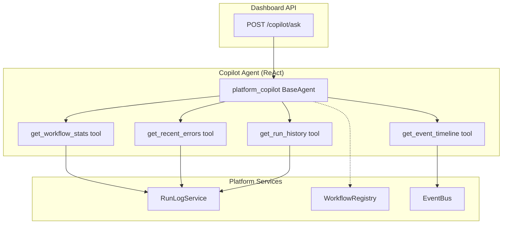

# Phase 2D. Dashboard Copilot — Meta-Agent for Platform Observability

> **Status**: ✅ COMPLETED  
> **Effort**: ~60 min  
> **Type**: NEW (API Layer + Agent)  
> **Parent**: [dashboard-implementation.md](../dashboard-implementation.md) § Phase 2C  
> **Depends on**: Phase 2A (Response Models), Phase 0 (RunLogService), Phase 1 (EventBus history)

---

## Problem Statement

Today, debugging a failed workflow requires manually navigating multiple endpoints: check `/runs` for the failed run, load `/runs/{id}` for the trace, check `/events` for related errors, and cross-reference with `/pipeline` for the topology. This is labor-intensive and requires platform expertise.

The Dashboard Copilot is a **ReAct meta-agent** equipped with read-only platform tools that can answer natural language questions like:

- _"Why did bank_to_ynab fail today?"_
- _"What's the success rate for polymarket_btc this week?"_
- _"Show me the last 5 errors across all workflows."_

---

## Architecture Alignment

| ARCHITECTURE.md Section | Requirement                                   | Current            | Target                                       |
| ----------------------- | --------------------------------------------- | ------------------ | -------------------------------------------- |
| §3 Agent Construction   | Use factory pattern (`create_platform_agent`) | N/A                | Copilot uses `create_platform_agent` factory |
| §3.2 Guardrails         | Guardrails for input/output validation        | N/A                | Input length validated via Pydantic model    |
| §4 Orchestration        | ReAct loop for autonomous reasoning           | ReactRunner exists | Copilot agent runs inside ReactRunner        |
| §5 Observability        | OTel spans on all endpoints                   | N/A                | `tracer.start_as_current_span`               |
| §1 Core Philosophy      | **NEVER `asyncio.create_task`**               | N/A                | Copilot runs synchronously within request    |

> [!NOTE]
> The Copilot runs **synchronously within the request** (not via EventBus dispatch). This is correct because:
>
> - The user is waiting for the answer (conversational pattern).
> - The ReAct loop operates on read-only platform data (fast operations).
> - There is no long-running background work to dispatch.

---

## Architecture: Copilot Agent Design

The copilot is a standard `BaseAgent` equipped with **read-only FunctionalAgent tools** that query existing platform services. It runs inside the existing `ReactRunner` infrastructure.



---

## Prerequisites

- Phase 2A complete (CopilotQuery, CopilotResponse, CopilotToolCall importable).
- `ReactRunner` functional (`autopilot.core.react`).
- `RunLogService` functional with `list_runs`, `get_stats`.
- `EventBus` functional with `history()`.

**Verify prerequisites**:

```bash
python -c "from autopilot.api.v1.routes_models import CopilotQuery, CopilotResponse, CopilotToolCall; print('Models OK')"
python -c "from autopilot.core.react import ReactRunner; print('ReactRunner OK')"
python -c "from autopilot.core.run_log import get_run_log_service; print('RunLog OK')"
```

---

## Implementation

### Step 1: Create `autopilot/api/v1/copilot.py` [NEW]

```python
"""
Platform Copilot API — Agentic observability endpoint.

A ReAct meta-agent that answers natural language questions about the
platform by querying RunLogService, EventBus, and WorkflowRegistry.

All tools are **read-only** — the copilot cannot modify platform state.

Endpoint:
  POST /dashboard/copilot/ask  →  CopilotResponse
"""

from __future__ import annotations

import json
from typing import Any

import structlog
from fastapi import APIRouter
from opentelemetry import trace

from autopilot.api.v1.routes_models import (
    CopilotQuery,
    CopilotResponse,
    CopilotToolCall,
)
from autopilot.core.agent import BaseAgent, FunctionalAgent
from autopilot.core.context import AgentContext
from autopilot.core.react import ReactRunner
from autopilot.core.run_log import get_run_log_service
from autopilot.core.bus import get_event_bus
from autopilot.errors import DashboardError
from autopilot.registry import get_registry

logger = structlog.get_logger(__name__)
tracer = trace.get_tracer(__name__)

copilot_router = APIRouter(prefix="/copilot", tags=["dashboard-copilot"])


# ━━━━━━━━━━━━━━━━━━━━━━━━━━━━━━━━━━━━━━━━━━━━━━━━━━━━━━━━━━━━━━━━━━━━
#  Copilot Tools — Read-only platform introspection
# ━━━━━━━━━━━━━━━━━━━━━━━━━━━━━━━━━━━━━━━━━━━━━━━━━━━━━━━━━━━━━━━━━━━━


async def get_workflow_stats(state: dict[str, Any]) -> dict[str, Any]:
    """Fetch run statistics for a specific workflow.

    Reads the `_copilot_tool_input` key from state for the workflow_id.
    Returns total runs, successful runs, failed runs, and success rate.
    """
    workflow_id = state.get("_copilot_tool_input", "")
    if not workflow_id:
        # If no specific workflow, return stats for all workflows
        registry = get_registry()
        all_stats = {}
        run_log = get_run_log_service()
        for info in registry.list_all():
            stats = await run_log.get_stats(info.name)
            all_stats[info.name] = stats
        return {"all_workflow_stats": all_stats, "react_finished": False}

    run_log = get_run_log_service()
    stats = await run_log.get_stats(workflow_id)
    return {"workflow_stats": {workflow_id: stats}, "react_finished": False}


async def get_recent_errors(state: dict[str, Any]) -> dict[str, Any]:
    """Fetch recent run failures across all workflows.

    Returns the last N failed runs with their error messages,
    useful for root cause analysis.
    """
    limit = int(state.get("_copilot_tool_input", "10") or "10")
    registry = get_registry()
    run_log = get_run_log_service()
    errors = []

    for info in registry.list_all():
        runs, _ = await run_log.list_runs(info.name, limit=limit)
        for run in runs:
            if run.status.value == "failed" and run.error:
                errors.append({
                    "workflow": info.name,
                    "run_id": run.id,
                    "error": run.error,
                    "started_at": run.started_at.isoformat() if run.started_at else "",
                    "duration_ms": run.duration_ms,
                })

    # Sort by recency, take top N
    errors.sort(key=lambda e: e.get("started_at", ""), reverse=True)
    return {"recent_errors": errors[:limit], "react_finished": False}


async def get_run_history(state: dict[str, Any]) -> dict[str, Any]:
    """Fetch recent run history for a specific workflow.

    Returns the last N runs with status, duration, and timing.
    """
    workflow_id = state.get("_copilot_tool_input", "")
    if not workflow_id:
        return {"error": "workflow_id is required", "react_finished": False}

    run_log = get_run_log_service()
    runs, _ = await run_log.list_runs(workflow_id, limit=20)
    history = [
        {
            "run_id": r.id,
            "status": r.status.value,
            "duration_ms": r.duration_ms,
            "started_at": r.started_at.isoformat() if r.started_at else "",
            "error": r.error,
        }
        for r in runs
    ]
    return {"run_history": history, "react_finished": False}


async def get_event_timeline(state: dict[str, Any]) -> dict[str, Any]:
    """Fetch recent EventBus events for observability.

    Returns the last N events across all topics, useful for
    understanding the sequence of platform operations.
    """
    topic = state.get("_copilot_tool_input", "*") or "*"
    bus = get_event_bus()

    if topic == "*":
        all_topics = list(getattr(bus, "_history", {}).keys())
        messages = []
        for t in all_topics:
            messages.extend(bus.history(t, limit=20))
        messages.sort(key=lambda m: m.timestamp, reverse=True)
        messages = messages[:20]
    else:
        messages = bus.history(topic, limit=20)

    events = [
        {
            "topic": m.topic,
            "sender": m.sender,
            "timestamp": m.timestamp,
            "payload_summary": str(m.payload)[:200],
        }
        for m in messages
    ]
    return {"event_timeline": events, "react_finished": False}


# ━━━━━━━━━━━━━━━━━━━━━━━━━━━━━━━━━━━━━━━━━━━━━━━━━━━━━━━━━━━━━━━━━━━━
#  Copilot Agent — ReAct meta-agent
# ━━━━━━━━━━━━━━━━━━━━━━━━━━━━━━━━━━━━━━━━━━━━━━━━━━━━━━━━━━━━━━━━━━━━


class CopilotAgent(BaseAgent):
    """Platform observability copilot using ReAct reasoning.

    On each iteration:
      1. Examines the user query and any previously gathered data in state
      2. Decides which tool to invoke (or concludes with an answer)
      3. Invokes the chosen tool via FunctionalAgent delegation
      4. Sets react_finished=True when it has enough info to answer

    This agent operates entirely on READ-ONLY platform data.
    """

    def __init__(self):
        super().__init__(name="platform_copilot")
        self.tools = {
            "get_workflow_stats": FunctionalAgent(get_workflow_stats),
            "get_recent_errors": FunctionalAgent(get_recent_errors),
            "get_run_history": FunctionalAgent(get_run_history),
            "get_event_timeline": FunctionalAgent(get_event_timeline),
        }

    async def invoke(
        self,
        ctx: AgentContext,
        input_data: dict[str, Any],
    ) -> dict[str, Any]:
        """Reason about the query and invoke tools as needed.

        Simple heuristic-based tool selection (no LLM needed for tool routing):
          - Query mentions "fail"/"error" → get_recent_errors
          - Query mentions a specific workflow name → get_workflow_stats + get_run_history
          - Query mentions "event"/"timeline" → get_event_timeline
          - Otherwise → get_workflow_stats (all) for overview
        """
        query = input_data.get("user_prompt", "").lower()
        tools_called = input_data.get("_copilot_tools_called", [])
        gathered_data = input_data.get("_copilot_gathered", {})
        iteration = len(tools_called)

        # Decide which tool to call based on query analysis
        if iteration == 0:
            # First iteration: primary tool selection
            if any(w in query for w in ["fail", "error", "crash", "broken"]):
                tool_name = "get_recent_errors"
                tool_input = "10"
            elif any(w in query for w in ["event", "timeline", "what happened"]):
                tool_name = "get_event_timeline"
                tool_input = "*"
            else:
                # Try to extract a workflow name from the query
                registry = get_registry()
                workflow_names = [info.name for info in registry.list_all()]
                found_workflow = next(
                    (name for name in workflow_names if name in query),
                    None,
                )
                if found_workflow:
                    tool_name = "get_workflow_stats"
                    tool_input = found_workflow
                else:
                    tool_name = "get_workflow_stats"
                    tool_input = ""  # All workflows
        elif iteration == 1:
            # Second iteration: gather complementary data
            if "get_recent_errors" not in tools_called and any(
                w in query for w in ["why", "fail", "root cause"]
            ):
                tool_name = "get_recent_errors"
                tool_input = "5"
            elif "get_run_history" not in tools_called:
                # Get run history for context
                registry = get_registry()
                workflow_names = [info.name for info in registry.list_all()]
                found_workflow = next(
                    (name for name in workflow_names if name in query),
                    None,
                )
                if found_workflow:
                    tool_name = "get_run_history"
                    tool_input = found_workflow
                else:
                    return {
                        "_copilot_answer": self._synthesize_answer(query, gathered_data),
                        "react_finished": True,
                    }
            else:
                return {
                    "_copilot_answer": self._synthesize_answer(query, gathered_data),
                    "react_finished": True,
                }
        else:
            # Third+ iteration: synthesize answer from gathered data
            return {
                "_copilot_answer": self._synthesize_answer(query, gathered_data),
                "react_finished": True,
            }

        # Invoke the selected tool
        ctx.logger.info("copilot_tool_call", tool=tool_name, input=tool_input)
        tool_agent = self.tools[tool_name]
        result = await tool_agent.invoke(ctx, {"_copilot_tool_input": tool_input})

        # Accumulate data and track which tools were called
        new_gathered = {**gathered_data, **result}
        new_tools = tools_called + [tool_name]

        return {
            "_copilot_gathered": new_gathered,
            "_copilot_tools_called": new_tools,
            "_copilot_last_tool": tool_name,
        }

    def _synthesize_answer(self, query: str, data: dict[str, Any]) -> str:
        """Synthesize a human-readable answer from gathered platform data.

        This is a template-based synthesis (no LLM). For a more natural
        response, this could be replaced with an LLM summarization step.
        """
        parts = []

        if "all_workflow_stats" in data:
            stats = data["all_workflow_stats"]
            parts.append("**Platform Overview:**")
            for name, s in stats.items():
                total = s.get("total", 0)
                successful = s.get("successful", 0)
                rate = round(successful / total * 100, 1) if total > 0 else 0
                parts.append(f"  - {name}: {total} runs, {rate}% success rate")

        if "workflow_stats" in data:
            for name, s in data["workflow_stats"].items():
                total = s.get("total", 0)
                successful = s.get("successful", 0)
                rate = round(successful / total * 100, 1) if total > 0 else 0
                parts.append(f"**{name}**: {total} total runs, {rate}% success rate")

        if "recent_errors" in data:
            errors = data["recent_errors"]
            if errors:
                parts.append(f"\n**Recent Errors ({len(errors)}):**")
                for e in errors[:5]:
                    parts.append(
                        f"  - [{e['workflow']}] {e['run_id']}: {e['error'][:100]}"
                    )
            else:
                parts.append("No recent errors found.")

        if "run_history" in data:
            history = data["run_history"]
            if history:
                parts.append(f"\n**Recent Runs ({len(history)}):**")
                for r in history[:5]:
                    parts.append(
                        f"  - {r['run_id']}: {r['status']} ({r['duration_ms']}ms)"
                    )

        if "event_timeline" in data:
            events = data["event_timeline"]
            if events:
                parts.append(f"\n**Recent Events ({len(events)}):**")
                for e in events[:5]:
                    parts.append(f"  - [{e['topic']}] {e['sender']}: {e['payload_summary'][:80]}")

        return "\n".join(parts) if parts else "I couldn't find relevant data to answer your question."


# ━━━━━━━━━━━━━━━━━━━━━━━━━━━━━━━━━━━━━━━━━━━━━━━━━━━━━━━━━━━━━━━━━━━━
#  Endpoint
# ━━━━━━━━━━━━━━━━━━━━━━━━━━━━━━━━━━━━━━━━━━━━━━━━━━━━━━━━━━━━━━━━━━━━


@copilot_router.post("/ask")
async def ask_copilot(req: CopilotQuery) -> dict[str, Any]:
    """Converse with the platform Dashboard Copilot meta-agent.

    The copilot uses a ReAct reasoning loop to:
      1. Analyze the user's question
      2. Query platform services (RunLog, EventBus, Registry)
      3. Synthesize a structured answer

    All operations are read-only. Copilot cannot modify platform state.
    Max 5 ReAct iterations to prevent runaway loops.
    """
    with tracer.start_as_current_span(
        "dashboard.copilot_ask",
        attributes={"query_length": len(req.query)},
    ):
        try:
            copilot = CopilotAgent()
            runner = ReactRunner("copilot_runner", copilot, max_iterations=5)

            ctx = AgentContext(pipeline_name="platform_copilot")
            result = await runner.execute(ctx, initial_input={"user_prompt": req.query})

            # Extract answer and tool calls from final state
            answer = result.state.get("_copilot_answer", "Unable to determine an answer.")
            tools_called = result.state.get("_copilot_tools_called", [])

            tool_records = [
                CopilotToolCall(
                    tool_name=name,
                    input_summary=f"Iteration {i+1}",
                    output_summary="Data gathered",
                ).model_dump()
                for i, name in enumerate(tools_called)
            ]

            response = CopilotResponse(
                reply=answer,
                tools_used=tool_records,
                iterations=len(result.steps_completed),
            )
            return response.model_dump(mode="json")

        except Exception as exc:
            logger.error("copilot_error", error=str(exc))
            raise DashboardError(
                f"Copilot failed: {exc}",
                detail="The Platform Copilot encountered an error during reasoning.",
            )
```

### Step 2: Mount copilot router in `autopilot/api/v1/routes.py` [MODIFY]

Add after the existing `router` import and mount:

```python
from autopilot.api.v1.copilot import copilot_router

# ... existing code ...

router.include_router(copilot_router)
```

**Alternative**: Mount under the dashboard router in `dashboard.py` for consistent prefix:

```python
# In dashboard.py, at the bottom:
from autopilot.api.v1.copilot import copilot_router
router.include_router(copilot_router)
```

> [!NOTE]
> The preferred approach is mounting via `dashboard.py` so the copilot endpoint becomes `/api/v1/copilot/ask` — consistent with the dashboard namespace and inheriting the same auth dependency.

### Step 3: Verify

```bash
python -c "from autopilot.api.v1.copilot import copilot_router; print(f'{len(copilot_router.routes)} copilot routes')"
python -c "from autopilot.api.v1.routes import router; print(f'{len(router.routes)} total routes')"
```

---

## Endpoint Reference

### `POST /api/v1/copilot/ask`

Ask the platform copilot a natural language question.

**Request body**:

```json
{
  "query": "Why did bank_to_ynab fail today?"
}
```

**Response shape** (200):

```json
{
  "reply": "**bank_to_ynab**: 15 total runs, 86.7% success rate\n\n**Recent Errors (2):**\n  - [bank_to_ynab] run_abc123: YNAB API rate limit exceeded...",
  "tools_used": [
    {
      "tool_name": "get_workflow_stats",
      "input_summary": "Iteration 1",
      "output_summary": "Data gathered"
    },
    {
      "tool_name": "get_recent_errors",
      "input_summary": "Iteration 2",
      "output_summary": "Data gathered"
    }
  ],
  "iterations": 3
}
```

---

## Design Decisions

| Decision                                           | Rationale                                                                                               |
| -------------------------------------------------- | ------------------------------------------------------------------------------------------------------- |
| Heuristic tool routing (not LLM-based)             | Zero additional LLM cost; deterministic behavior; upgradable to LLM-based routing in a future iteration |
| `max_iterations=5` for ReAct loop                  | Copilot tools are fast read operations; 5 iterations is enough for any question                         |
| Synchronous execution (not EventBus dispatch)      | Conversational UX — user expects an immediate answer; tools are all read-only and fast                  |
| `CopilotAgent` extends `BaseAgent` (not ADK agent) | Uses platform's own agent contract; avoids ADK dependency for a simple heuristic agent                  |
| Read-only tools only                               | Safety — copilot cannot modify runs, trigger workflows, or mutate state                                 |
| Template-based synthesis (not LLM summarization)   | Predictable, fast, no token cost; can be upgraded to LLM later                                          |
| Mounted under `/dashboard/copilot` not `/copilot`  | Copilot is a dashboard feature; inherits dashboard auth and namespace                                   |
| `_copilot_*` state keys use underscore prefix      | Convention for internal copilot state that shouldn't conflict with tool outputs                         |

---

## Future Enhancements (Out of Scope)

- **LLM-powered tool routing**: Replace heuristic with an LLM agent that reasons about which tool to call.
- **LLM-powered answer synthesis**: Replace template-based `_synthesize_answer` with an LLM summarization step.
- **Conversation history**: Support multi-turn conversations by maintaining copilot session state.
- **Custom tools**: Allow workflows to register copilot-accessible tools for domain-specific questions.

---

## Files Modified

| File                            | Change                                           | Lines      |
| ------------------------------- | ------------------------------------------------ | ---------- |
| `autopilot/api/v1/copilot.py`   | **[NEW]** Copilot agent, tools, and API endpoint | ~300 lines |
| `autopilot/api/v1/dashboard.py` | Mount copilot router via `include_router`        | ~2 lines   |
