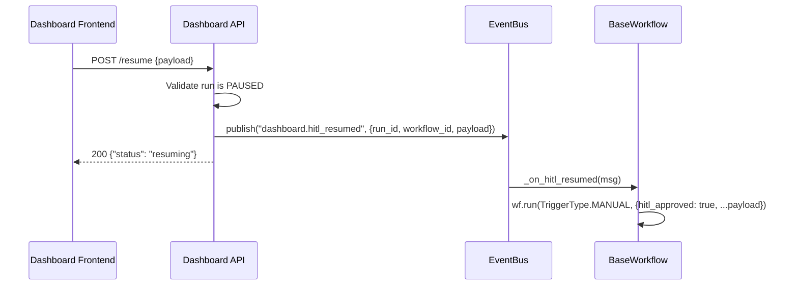

# Phase 2B. HITL Endpoints — Pending Actions & Resume API

> **Status**: ✅ COMPLETED  
> **Effort**: ~45 min  
> **Type**: MODIFY (API Layer + Platform Integration)  
> **Parent**: [dashboard-implementation.md](../dashboard-implementation.md) § Phase 2A-2B  
> **Depends on**: Phase 2A (Response Models), Phase 0 complete (RunLogService with `get_pending_runs`)

---

## Problem Statement

The platform's `Pipeline` engine already supports HITL pausing (via `hitl_requested` state flag), and `RunLogService` already tracks `PAUSED` runs. But there is **no external API surface** to:

1. **List** all globally paused runs awaiting human intervention.
2. **Resume** a paused run by injecting human decisions into the pipeline state.

Without these endpoints, HITL workflows are "fire and forget" — they pause but no external system can observe or resolve them.

---

## Architecture Alignment

| ARCHITECTURE.md Section | Requirement                                                | Current                                     | Target                                                         |
| ----------------------- | ---------------------------------------------------------- | ------------------------------------------- | -------------------------------------------------------------- |
| §1 Core Philosophy      | **NEVER `asyncio.create_task`** in ephemeral compute       | Original plan uses `asyncio.create_task` ❌ | Resume via EventBus dispatch — requestless execution           |
| §6 Error Taxonomy       | Use `AutoPilotError` subclasses, never raw `HTTPException` | Original plan uses `HTTPException(400)` ❌  | Uses `RunNotPausedError` (409) and `RunNotFoundError` (404)    |
| §4 Pipeline & HITL      | Pipeline supports `hitl_requested` pause/resume            | Pause works; resume has no external surface | Dashboard dispatches resume via EventBus → workflow subscribes |
| §5 Observability        | OTel spans on all endpoints                                | N/A                                         | Every endpoint wraps in `tracer.start_as_current_span`         |
| §1 Core Philosophy      | X-API-Key auth on all endpoints                            | Inherited from V1 router                    | All new endpoints inherit auth automatically                   |

> [!IMPORTANT]
> The original `dashboard-implementation.md` Phase 2A uses `asyncio.create_task(wf.resume(...))` — this is a **§1 violation** (no background tasks in ephemeral compute). The original also uses raw `HTTPException(400)` — a **§6 violation**. This spec redesigns both to be architecturally compliant.

---

## Architecture Decision: EventBus-Driven Resume

The resume endpoint does **not** execute the workflow directly. Instead, it:

1. Validates the run is in `PAUSED` state.
2. Publishes a `dashboard.hitl_resumed` event to the EventBus with the resume payload.
3. Returns immediately with `{"status": "resuming"}`.

The workflow picks up the event via its existing `setup()` subscriber pattern (same as `email.received` for `bank_to_ynab`). This is:

- **Scale-to-zero safe**: No background tasks outlive the request.
- **Edge-safe**: The API request completes instantly; execution is decoupled.
- **Production-ready**: In Pub/Sub mode, the event is durably queued even if the container scales down.



---

## Prerequisites

- Phase 2A complete (models importable).
- `RunLogService.get_pending_runs()` functional (Phase 0).
- `RunNotPausedError` added to error taxonomy (Phase 2A).

**Verify prerequisites**:

```bash
python -c "from autopilot.api.v1.routes_models import PendingRunItem, ResumeRunRequest, ResumeRunResponse; print('Models OK')"
python -c "from autopilot.errors import RunNotPausedError, RunNotFoundError; print('Errors OK')"
python -c "from autopilot.core.run_log import get_run_log_service; print('RunLog OK')"
```

---

## Implementation

### Step 1: Add HITL subscriber to `autopilot/base_workflow.py` [MODIFY]

Add the following method to `BaseWorkflow`, and modify `setup()` to register the subscriber:

**Add to `setup()` (after the existing run log hydration):**

```python
    async def setup(self) -> None:
        """Lifecycle hook — called once after registration.

        Hydrates run stats from durable backend on cold start.
        Registers HITL resume subscriber on the EventBus.
        Override in subclasses for workflow-specific setup (call super!).
        """
        # ... existing run log hydration code ...

        # Register HITL resume subscriber
        try:
            from autopilot.core.bus import get_event_bus
            from autopilot.core.subscriber_registry import get_subscriber_registry

            registry = get_subscriber_registry()
            registry.register(
                "dashboard.hitl_resumed",
                self._on_hitl_resumed,
                name=f"{self.manifest.name}_hitl_resume",
            )
            logger.debug("hitl_subscriber_registered", workflow=self.manifest.name)
        except Exception:
            logger.debug("hitl_subscriber_registration_skipped", workflow=self.manifest.name)
```

**Add new method to `BaseWorkflow`:**

```python
    async def _on_hitl_resumed(self, msg) -> None:
        """Handle HITL resume events from the EventBus.

        Dispatched by the dashboard API when a human approves a paused run.
        Only processes events targeting this specific workflow.

        The message payload contains:
          - workflow_id: Must match this workflow's name
          - run_id: The paused run to resume
          - payload: Human override data to inject into state
        """
        payload = msg.payload if hasattr(msg, "payload") else msg
        target_workflow = payload.get("workflow_id", "")

        if target_workflow != self.manifest.name:
            return  # Not for us — ignore

        run_id = payload.get("run_id", "")
        hitl_payload = payload.get("payload", {})

        logger.info(
            "hitl_resume_received",
            workflow=self.manifest.name,
            run_id=run_id,
        )

        # Inject hitl_approved flag + human payload into trigger data
        resume_data = {
            **hitl_payload,
            "hitl_approved": True,
            "__resume_run_id__": run_id,
        }

        try:
            await self.run(TriggerType.MANUAL, resume_data)
        except Exception as exc:
            logger.error(
                "hitl_resume_failed",
                workflow=self.manifest.name,
                run_id=run_id,
                error=str(exc),
            )
```

### Step 2: Add HITL endpoints to `autopilot/api/v1/dashboard.py` [MODIFY]

Add these endpoints **after** the existing `dashboard_health` endpoint:

```python
# ━━━━━━━━━━━━━━━━━━━━━━━━━━━━━━━━━━━━━━━━━━━━━━━━━━━━━━━━━━━━━━━━━━━━
#  HITL — Human-in-the-Loop endpoints (Phase 2)
# ━━━━━━━━━━━━━━━━━━━━━━━━━━━━━━━━━━━━━━━━━━━━━━━━━━━━━━━━━━━━━━━━━━━━


@router.get("/runs/pending-action")
async def list_pending_runs() -> dict[str, Any]:
    """Get all runs globally paused waiting for Human Interaction (HITL).

    Queries RunLogService for all runs with status=PAUSED across all workflows.
    Returns enriched PendingRunItem projections for dashboard display.
    """
    with tracer.start_as_current_span("dashboard.pending_runs"):
        run_log = get_run_log_service()
        runs = await run_log.get_pending_runs()
        items = [
            PendingRunItem(
                run_id=r.id,
                workflow_id=r.workflow_id,
                status=r.status,
                trigger_type=r.trigger_type.value if r.trigger_type else "",
                started_at=r.started_at.isoformat() if r.started_at else "",
                paused_step=r.result.get("__steps_completed__", [""])[-1]
                if r.result and isinstance(r.result, dict)
                else "",
            ).model_dump(mode="json")
            for r in runs
        ]
        return {"runs": items, "total": len(items)}


@router.post("/workflows/{workflow_id}/runs/{run_id}/resume")
async def resume_run(
    workflow_id: str,
    run_id: str,
    body: ResumeRunRequest,
) -> dict[str, Any]:
    """Resume a paused HITL workflow run by injecting human override data.

    Architecture: Does NOT execute the workflow inline. Instead, publishes
    a 'dashboard.hitl_resumed' event to the EventBus. The workflow picks
    up the event via its setup() subscriber — decoupled, scale-to-zero safe.

    Validates:
      1. Workflow exists (DashboardWorkflowNotFoundError → 404)
      2. Run exists (RunNotFoundError → 404)
      3. Run is in PAUSED state (RunNotPausedError → 409)
    """
    with tracer.start_as_current_span(
        "dashboard.resume_run",
        attributes={"workflow_id": workflow_id, "run_id": run_id},
    ):
        # 1. Validate workflow exists
        _get_workflow(workflow_id)

        # 2. Validate run exists
        run_log = get_run_log_service()
        run = await run_log.get_run(workflow_id, run_id)
        if not run:
            raise RunNotFoundError(f"Run '{run_id}' not found in workflow '{workflow_id}'")

        # 3. Validate run is PAUSED
        if run.status != RunStatus.PAUSED:
            raise RunNotPausedError(
                f"Run '{run_id}' is in '{run.status.value}' state, not PAUSED",
                detail=f"Only runs with status=PAUSED can be resumed. Current: {run.status.value}",
            )

        # 4. Dispatch via EventBus (scale-to-zero safe — no asyncio.create_task)
        bus = get_event_bus()
        await bus.publish(
            "dashboard.hitl_resumed",
            sender="dashboard_api",
            payload={
                "run_id": run_id,
                "workflow_id": workflow_id,
                "payload": body.payload,
            },
        )

        logger.info(
            "hitl_resume_dispatched",
            workflow_id=workflow_id,
            run_id=run_id,
        )

        response = ResumeRunResponse(
            status="resuming",
            run_id=run_id,
            workflow_id=workflow_id,
        )
        return response.model_dump(mode="json")
```

### Step 3: Add required imports to `dashboard.py`

Add these to the existing imports at the top of `autopilot/api/v1/dashboard.py`:

```python
# Add to existing dashboard_models imports:
from autopilot.api.v1.routes_models import (
    # ... existing imports ...
    PendingRunItem,
    ResumeRunRequest,
    ResumeRunResponse,
)

# Add to existing errors imports:
from autopilot.errors import (
    DashboardWorkflowNotFoundError,
    RunNotFoundError,
    RunNotPausedError,
)

# Add to existing models imports:
from autopilot.models import AgentCard, RunStatus
```

### Step 4: Verify

```bash
python -c "from autopilot.api.v1.routes import router; print(f'{len(router.routes)} routes')"
```

---

## Endpoint Reference

### `GET /api/v1/runs/pending-action`

Lists all globally paused HITL runs across all workflows.

**Response shape**:

```json
{
  "runs": [
    {
      "run_id": "run_abc123def456",
      "workflow_id": "bank_to_ynab",
      "status": "paused",
      "trigger_type": "gmail_push",
      "started_at": "2026-02-26T10:00:00Z",
      "paused_step": "categorizer"
    }
  ],
  "total": 1
}
```

---

### `POST /api/v1/workflows/{workflow_id}/runs/{run_id}/resume`

Resume a paused HITL run with human override data.

**Request body**:

```json
{
  "payload": {
    "approved_category": "Groceries",
    "corrected_amount": 45000
  }
}
```

**Response shape** (200):

```json
{
  "status": "resuming",
  "run_id": "run_abc123def456",
  "workflow_id": "bank_to_ynab",
  "event_topic": "dashboard.hitl_resumed"
}
```

**Error responses**:

| Status | Error Code                     | Condition                               |
| ------ | ------------------------------ | --------------------------------------- |
| 404    | `RUN_NOT_FOUND`                | Run ID doesn't exist in RunLogService   |
| 409    | `RUN_NOT_PAUSED`               | Run exists but is not in `PAUSED` state |
| 404    | `DASHBOARD_WORKFLOW_NOT_FOUND` | Workflow ID not in registry             |

---

## Design Decisions

| Decision                                                 | Rationale                                                                                                                                    |
| -------------------------------------------------------- | -------------------------------------------------------------------------------------------------------------------------------------------- |
| Resume via EventBus dispatch (not `asyncio.create_task`) | **ARCHITECTURE.md §1**: NEVER `asyncio.create_task` in ephemeral compute. EventBus is durable (Pub/Sub in production) and scale-to-zero safe |
| `RunNotPausedError` with HTTP 409 (not 400)              | HTTP 409 Conflict is semantically correct — the request is valid but the resource's current state doesn't permit the operation               |
| `_on_hitl_resumed` in `BaseWorkflow` (not per-workflow)  | All workflows benefit from HITL resume capability — zero boilerplate for workflow authors                                                    |
| `_on_hitl_resumed` filters by `workflow_id`              | The EventBus broadcast is global; each workflow instance only processes its own events                                                       |
| `__resume_run_id__` injected into state                  | The pipeline can correlate the resume with the original paused run for tracing                                                               |
| Endpoint returns immediately ("fire and dispatch")       | Frontend gets instant confirmation; actual execution happens asynchronously via EventBus                                                     |
| `PendingRunItem` as projection (not full `WorkflowRun`)  | Minimal blast radius — only decision-relevant fields exposed to frontend                                                                     |
| `paused_step` extracted from `__steps_completed__`       | Pipeline already tracks completed steps in state; last entry is where it paused                                                              |

---

## Files Modified

| File                                   | Change                                                     | Lines     |
| -------------------------------------- | ---------------------------------------------------------- | --------- |
| `autopilot/base_workflow.py`           | Add `_on_hitl_resumed()` + modify `setup()` for subscriber | ~35 lines |
| `autopilot/api/v1/dashboard.py`        | Add `list_pending_runs` + `resume_run` endpoints           | ~70 lines |
| `autopilot/api/v1/dashboard_models.py` | (Done in Phase 2A)                                         | —         |
| `autopilot/errors.py`                  | (Done in Phase 2A)                                         | —         |
