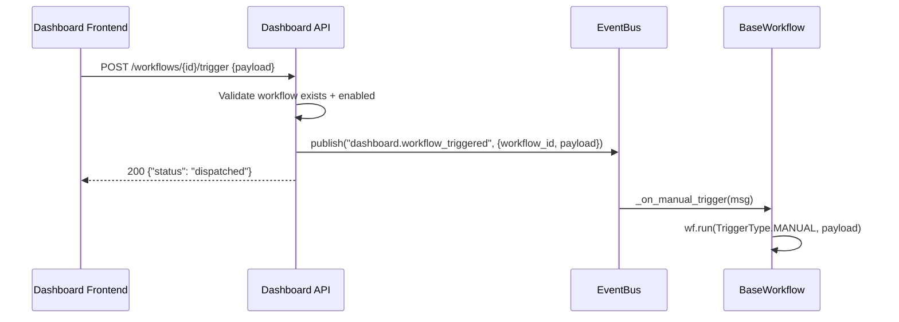

# Phase 2C. Manual Workflow Trigger API

> **Status**: ✅ COMPLETED  
> **Effort**: ~20 min  
> **Type**: MODIFY (API Layer)  
> **Parent**: [dashboard-implementation.md](../dashboard-implementation.md) § Phase 2B  
> **Depends on**: Phase 2A (Response Models), Phase 1 complete

---

## Problem Statement

Currently, workflows can only be triggered by their configured external sources (Gmail push, webhooks, Cloud Scheduler). There is **no API surface** for a dashboard operator to manually trigger a workflow run with custom payload data. This is essential for:

- **Testing**: Run a workflow with specific test data without setting up the external trigger.
- **Recovery**: Re-run a failed workflow with corrected input data.
- **Operations**: Execute on-demand workflows (e.g., data reconciliation) from the dashboard.

---

## Architecture Alignment

| ARCHITECTURE.md Section | Requirement                                                | Current | Target                                                   |
| ----------------------- | ---------------------------------------------------------- | ------- | -------------------------------------------------------- |
| §1 Core Philosophy      | **NEVER `asyncio.create_task`** in ephemeral compute       | N/A     | Dispatch via EventBus, not inline execution              |
| §6 Error Taxonomy       | Use `AutoPilotError` subclasses, never raw `HTTPException` | N/A     | Uses `DashboardWorkflowNotFoundError` + `DashboardError` |
| §5 Observability        | OTel spans on all endpoints                                | N/A     | `tracer.start_as_current_span`                           |
| §1 Core Philosophy      | Headless API — JSON responses only                         | N/A     | Typed Pydantic response (`TriggerWorkflowResponse`)      |

> [!IMPORTANT]
> The original `dashboard-implementation.md` Phase 2B calls `await wf.run(...)` **inline** within the request handler. This blocks the HTTP response until the workflow completes — potentially minutes for complex pipelines. This spec redesigns the trigger to use EventBus dispatch for immediate response.

---

## Architecture Decision: EventBus-Driven Trigger

Same pattern as HITL resume: the endpoint publishes a `dashboard.workflow_triggered` event and returns immediately. The workflow's existing subscriber infrastructure picks up the event.



---

## Prerequisites

- Phase 2A complete (models importable).
- Phase 1 complete (dashboard router mounted).

**Verify prerequisites**:

```bash
python -c "from autopilot.api.v1.routes_models import TriggerWorkflowRequest, TriggerWorkflowResponse; print('OK')"
```

---

## Implementation

### Step 1: Add manual trigger subscriber to `autopilot/base_workflow.py` [MODIFY]

Add to `setup()` (alongside the HITL subscriber from Phase 2B):

```python
        # Register manual trigger subscriber
        try:
            registry.register(
                "dashboard.workflow_triggered",
                self._on_manual_trigger,
                name=f"{self.manifest.name}_manual_trigger",
            )
            logger.debug("manual_trigger_subscriber_registered", workflow=self.manifest.name)
        except Exception:
            logger.debug("manual_trigger_subscriber_registration_skipped", workflow=self.manifest.name)
```

Add the handler method to `BaseWorkflow`:

```python
    async def _on_manual_trigger(self, msg) -> None:
        """Handle manual trigger events from the Dashboard API.

        Dispatched when a dashboard operator clicks "Run" on a workflow.
        Only processes events targeting this specific workflow.
        """
        payload = msg.payload if hasattr(msg, "payload") else msg
        target_workflow = payload.get("workflow_id", "")

        if target_workflow != self.manifest.name:
            return  # Not for us — ignore

        trigger_data = payload.get("payload", {})

        logger.info(
            "manual_trigger_received",
            workflow=self.manifest.name,
        )

        try:
            await self.run(TriggerType.MANUAL, trigger_data)
        except Exception as exc:
            logger.error(
                "manual_trigger_failed",
                workflow=self.manifest.name,
                error=str(exc),
            )
```

### Step 2: Add trigger endpoint to `autopilot/api/v1/dashboard.py` [MODIFY]

Add after the HITL endpoints:

```python
# ━━━━━━━━━━━━━━━━━━━━━━━━━━━━━━━━━━━━━━━━━━━━━━━━━━━━━━━━━━━━━━━━━━━━
#  Manual Trigger — Workflow execution from Dashboard (Phase 2)
# ━━━━━━━━━━━━━━━━━━━━━━━━━━━━━━━━━━━━━━━━━━━━━━━━━━━━━━━━━━━━━━━━━━━━


@router.post("/workflows/{workflow_id}/trigger")
async def trigger_workflow(
    workflow_id: str,
    body: TriggerWorkflowRequest,
) -> dict[str, Any]:
    """Manually trigger a workflow from the Dashboard.

    Architecture: Does NOT execute the workflow inline. Instead, publishes
    a 'dashboard.workflow_triggered' event to the EventBus. The workflow
    picks it up via its setup() subscriber — decoupled, scale-to-zero safe.

    Validates:
      1. Workflow exists (DashboardWorkflowNotFoundError → 404)
      2. Workflow is enabled (DashboardError → 409)
    """
    with tracer.start_as_current_span(
        "dashboard.trigger_workflow",
        attributes={"workflow_id": workflow_id},
    ):
        # 1. Validate workflow exists
        wf = _get_workflow(workflow_id)

        # 2. Validate workflow is enabled
        if not wf.manifest.enabled:
            raise DashboardError(
                f"Workflow '{workflow_id}' is disabled and cannot be triggered",
                detail="Enable the workflow in its manifest.yaml before triggering.",
            )

        # 3. Dispatch via EventBus
        bus = get_event_bus()
        await bus.publish(
            "dashboard.workflow_triggered",
            sender="dashboard_api",
            payload={
                "workflow_id": workflow_id,
                "payload": body.payload,
            },
        )

        logger.info(
            "workflow_trigger_dispatched",
            workflow_id=workflow_id,
        )

        response = TriggerWorkflowResponse(
            status="dispatched",
            workflow_id=workflow_id,
        )
        return response.model_dump(mode="json")
```

### Step 3: Add required imports to `dashboard.py`

Add to the existing model imports:

```python
from autopilot.api.v1.routes_models import (
    # ... existing + HITL imports ...
    TriggerWorkflowRequest,
    TriggerWorkflowResponse,
)

from autopilot.errors import (
    DashboardError,
    DashboardWorkflowNotFoundError,
    RunNotFoundError,
    RunNotPausedError,
)
```

### Step 4: Verify

```bash
# Check route count increased
python -c "from autopilot.api.v1.routes import router; print(f'{len(router.routes)} routes')"
```

---

## Endpoint Reference

### `POST /api/v1/workflows/{workflow_id}/trigger`

Manually dispatch a workflow execution.

**Request body**:

```json
{
  "payload": {
    "email_body": "Test email for debugging",
    "auto_create": false
  }
}
```

**Response shape** (200):

```json
{
  "status": "dispatched",
  "workflow_id": "bank_to_ynab",
  "event_topic": "dashboard.workflow_triggered"
}
```

**Error responses**:

| Status | Error Code                     | Condition                   |
| ------ | ------------------------------ | --------------------------- |
| 404    | `DASHBOARD_WORKFLOW_NOT_FOUND` | Workflow ID not in registry |
| 500    | `DASHBOARD_ERROR`              | Workflow is disabled        |

---

## Design Decisions

| Decision                                      | Rationale                                                                                        |
| --------------------------------------------- | ------------------------------------------------------------------------------------------------ |
| EventBus dispatch (not inline `wf.run()`)     | Workflows can take minutes; blocking the HTTP response is unacceptable for dashboard UX          |
| Enabled check before dispatch                 | Prevents triggering disabled workflows that would silently fail                                  |
| `TriggerType.MANUAL` for dashboard triggers   | Distinguishes dashboard-initiated runs from scheduled/webhook-initiated runs in RunLog analytics |
| Same subscriber pattern as HITL resume        | Consistent architecture; both are EventBus-driven workflow dispatches                            |
| `_on_manual_trigger` filters by `workflow_id` | Global broadcast; each workflow instance only processes its own events                           |

---

## Files Modified

| File                            | Change                                             | Lines     |
| ------------------------------- | -------------------------------------------------- | --------- |
| `autopilot/base_workflow.py`    | Add `_on_manual_trigger()` + register in `setup()` | ~25 lines |
| `autopilot/api/v1/dashboard.py` | Add `trigger_workflow` endpoint                    | ~40 lines |
