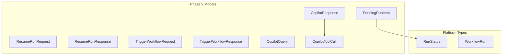

# Phase 2A. Response Models — HITL, Trigger & Copilot Schemas

> **Status**: ✅ COMPLETED  
> **Effort**: ~20 min  
> **Type**: MODIFY (API Layer)  
> **Parent**: [dashboard-implementation.md](../dashboard-implementation.md) § Phase 2  
> **Depends on**: Phase 1 complete (all dashboard endpoints live)

---

## Problem Statement

Phase 2 introduces **write endpoints** (HITL resume, manual trigger) and a **conversational copilot** — all requiring new Pydantic models. The existing `dashboard_models.py` only covers read-only projections. Without typed request/response schemas:

- POST body validation relies on raw `dict[str, Any]` — no OpenAPI docs, no IDE autocomplete.
- Resume state is untyped — callers can inject arbitrary payloads without validation.
- Copilot responses have no contract — frontend can't code-gen TypeScript types.

**Schema-First** (ARCHITECTURE.md §9 Rule 2): _All Pydantic models before logic._

---

## Architecture Alignment

| ARCHITECTURE.md Section | Requirement                                 | Current                        | Target                                         |
| ----------------------- | ------------------------------------------- | ------------------------------ | ---------------------------------------------- |
| §9 Rule 2               | Schema-First — Pydantic models before logic | No HITL/Copilot models         | Request + response models for all Phase 2 APIs |
| §1 Core Philosophy      | Headless API — JSON responses only          | Phase 1 models are read-only   | Add write models (request bodies)              |
| §4 Pipeline & HITL      | Typed HITL state injection                  | `hitl_requested` is a raw bool | Typed `ResumeRunRequest` with payload schema   |
| §6 Error Taxonomy       | Typed error responses                       | `RunNotFoundError` exists      | Add `RunNotPausedError` for resume validation  |

---

## Prerequisites

- Phase 1 fully complete (all dashboard endpoints functional).
- These must be importable:
  - `autopilot.api.v1.routes_models.*` (Phase 1A models)
  - `autopilot.models.RunStatus`, `WorkflowRun`
  - `autopilot.errors.DashboardError`

**Verify prerequisites**:

```bash
python -c "from autopilot.api.v1.routes_models import DashboardWorkflow, RunTrace; print('OK')"
python -c "from autopilot.errors import DashboardError, RunNotFoundError; print('OK')"
```

---

## Implementation

### Step 1: Add new error to `autopilot/errors.py` [MODIFY]

Add after `RunNotFoundError`:

```python
class RunNotPausedError(DashboardError):
    """Attempted to resume a run that is not in PAUSED state."""

    error_code = "RUN_NOT_PAUSED"
    http_status = 409  # Conflict — state precondition not met
```

Add to `__all__` list:

```python
    "RunNotPausedError",
```

### Step 2: Add Phase 2 models to `autopilot/api/v1/dashboard_models.py` [MODIFY]

Append the following models to the **end** of the existing file:

```python
# ── HITL (Human-in-the-Loop) ─────────────────────────────────────────


class PendingRunItem(BaseModel):
    """A paused run awaiting human intervention.

    Enriched projection of WorkflowRun with only the fields
    relevant to HITL decision-making in the dashboard.
    """

    run_id: str = Field(description="Unique run identifier")
    workflow_id: str = Field(description="Parent workflow name")
    status: RunStatus = Field(description="Always PAUSED for pending runs")
    trigger_type: str = ""
    started_at: str = ""
    paused_step: str = Field(
        default="",
        description="Name of the step where the pipeline paused (from __steps_completed__)",
    )


class ResumeRunRequest(BaseModel):
    """Request body for POST /dashboard/workflows/{id}/runs/{run_id}/resume.

    The `payload` dict is injected into the pipeline's AgentContext.state
    before resuming execution. It should contain the human's decision
    (e.g., approval, corrected data, override values).

    The `hitl_approved` flag is automatically set to True by the endpoint
    — callers do not need to include it in the payload.
    """

    payload: dict[str, Any] = Field(
        default_factory=dict,
        description="Human override data to inject into pipeline state before resume",
    )


class ResumeRunResponse(BaseModel):
    """Response from initiating a HITL resume."""

    status: str = Field(description="'resuming' — the run has been dispatched")
    run_id: str
    workflow_id: str
    event_topic: str = Field(
        default="dashboard.hitl_resumed",
        description="EventBus topic where the resume event was published",
    )


# ── Manual Trigger ───────────────────────────────────────────────────


class TriggerWorkflowRequest(BaseModel):
    """Request body for POST /dashboard/workflows/{id}/trigger.

    The `payload` dict becomes the `trigger_data` passed to
    `BaseWorkflow.run(TriggerType.MANUAL, payload)`.
    """

    payload: dict[str, Any] = Field(
        default_factory=dict,
        description="Trigger data passed to the workflow's execute() method",
    )


class TriggerWorkflowResponse(BaseModel):
    """Response from manually triggering a workflow."""

    status: str = Field(description="'dispatched' — the workflow run event has been published")
    workflow_id: str
    event_topic: str = Field(
        default="dashboard.workflow_triggered",
        description="EventBus topic where the trigger event was published",
    )


# ── Dashboard Copilot ────────────────────────────────────────────────


class CopilotQuery(BaseModel):
    """Request body for POST /dashboard/copilot/ask.

    The `query` is the natural language question about the platform.
    The copilot meta-agent uses read-only tools to inspect RunLog,
    EventBus history, and workflow manifests to answer.
    """

    query: str = Field(
        min_length=3,
        max_length=2000,
        description="Natural language question about the platform (e.g., 'Why did bank_to_ynab fail today?')",
    )


class CopilotToolCall(BaseModel):
    """Record of a single tool invocation by the copilot agent."""

    tool_name: str
    input_summary: str = ""
    output_summary: str = ""


class CopilotResponse(BaseModel):
    """Response from the platform copilot meta-agent."""

    reply: str = Field(description="Natural language answer from the copilot")
    tools_used: list[CopilotToolCall] = Field(
        default_factory=list,
        description="Tools the copilot invoked during reasoning",
    )
    iterations: int = Field(
        default=0,
        description="Number of ReAct loop iterations used",
    )
```

### Step 3: Verify compilation

```bash
python -c "
from autopilot.api.v1.routes_models import (
    PendingRunItem, ResumeRunRequest, ResumeRunResponse,
    TriggerWorkflowRequest, TriggerWorkflowResponse,
    CopilotQuery, CopilotResponse, CopilotToolCall,
)
print('Phase 2 Models OK')
"
python -c "from autopilot.errors import RunNotPausedError; print('Error OK')"
```

---

## Model Dependency Graph



---

## Model-to-Endpoint Mapping

| Model                     | Endpoint                                                | HTTP Method | Role     |
| ------------------------- | ------------------------------------------------------- | ----------- | -------- |
| `PendingRunItem`          | `/api/v1/runs/pending-action`                 | GET         | Response |
| `ResumeRunRequest`        | `/api/v1/workflows/{id}/runs/{run_id}/resume` | POST        | Request  |
| `ResumeRunResponse`       | `/api/v1/workflows/{id}/runs/{run_id}/resume` | POST        | Response |
| `TriggerWorkflowRequest`  | `/api/v1/workflows/{id}/trigger`              | POST        | Request  |
| `TriggerWorkflowResponse` | `/api/v1/workflows/{id}/trigger`              | POST        | Response |
| `CopilotQuery`            | `/api/v1/copilot/ask`                         | POST        | Request  |
| `CopilotResponse`         | `/api/v1/copilot/ask`                         | POST        | Response |

---

## Design Decisions

| Decision                                                  | Rationale                                                                                            |
| --------------------------------------------------------- | ---------------------------------------------------------------------------------------------------- | ------------------ |
| `ResumeRunRequest` wraps payload in typed model           | Prevents arbitrary JSON injection; validates before touching workflow state                          |
| `RunNotPausedError` as HTTP 409 Conflict                  | Semantically correct — the request is valid but the resource state doesn't allow the operation       |
| `CopilotToolCall` tracks tool usage                       | Transparency — dashboard can show which data sources the copilot consulted                           |
| `CopilotQuery` has `min_length=3`                         | Prevents empty/trivial queries that waste LLM tokens                                                 |
| `PendingRunItem` is a projection (not full `WorkflowRun`) | Dashboard only needs decision-relevant fields; avoids leaking internal state to frontend             |
| `TriggerWorkflowResponse` returns `event_topic`           | Enables frontend to subscribe to SSE for that topic and track the triggered run                      |
| All response models include `status` field                | Consistent pattern across all write endpoints — frontend can check status without parsing HTTP codes |
| `from __future__ import annotations` already in the file  | All new models get lazy annotation evaluation — `X                                                   | None` syntax works |

---

## Files Modified

| File                                   | Change                                          | Lines      |
| -------------------------------------- | ----------------------------------------------- | ---------- |
| `autopilot/errors.py`                  | Add `RunNotPausedError` (409)                   | ~6 lines   |
| `autopilot/api/v1/dashboard_models.py` | Add 8 new Pydantic models for Phase 2 endpoints | ~120 lines |
